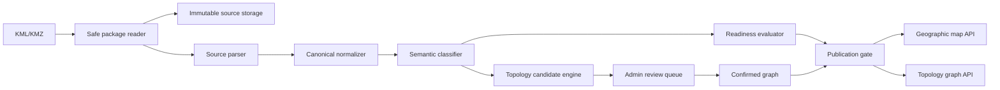

# Arsitektur Terpadu Parser dan Relasi Aset SINERGI

Status: target architecture dan implementation plan, tidak dibatasi oleh
implementasi saat ini
Keputusan: parser dan topology engine adalah satu pipeline terukur, tetapi
memiliki tanggung jawab dan output yang terpisah
Fokus: KML/KMZ aktual, peta geografis, candidate connection, konfirmasi
administrator, dan operational topology graph

Spesifikasi terpisah:

- [Planning Algoritma Relasi Aset](./PLANNING-ARSITEKTUR-ALGORITMA-RELASI-ASSET.md)
- [Planning Parser KML/KMZ](./PLANNING-ARSITEKTUR-PARSER-KML-KMZ.md)
- [Planning UI Peta dan Topologi](./PLANNING-ARSITEKTUR-UI-PETA-DAN-TOPOLOGI.md)

## 1. Keputusan utama

Dokumen ini merancang dua algoritma target berdasarkan hasil audit dan
perbaikan yang telah disepakati:

1. `Evidence-Preserving Semantic Parser`;
2. `Semantic Constrained Relation Engine`.

Implementasi saat ini hanya menjadi baseline migrasi dan tidak menjadi sumber
kebenaran untuk desain algoritma target.

Parser tidak boleh menebak relasi. Parser hanya mengekstrak fakta yang terdapat
pada sumber dan mempertahankan provenance.

Topology engine tidak boleh membaca KML mentah atau membuat klasifikasi sendiri.
Topology engine hanya menerima canonical feature yang sudah diklasifikasikan
oleh semantic classifier menggunakan rule set yang versioned.

Alur yang disetujui:

```text
KML/KMZ immutable
-> safe extraction
-> source parsing
-> canonical normalization
-> semantic classification
-> readiness evaluation
-> topology candidate generation
-> administrator review
-> confirmed operational graph
-> publication
```

Prinsip keselamatan:

> Parser mengekstrak bukti, classifier memberi makna, topology engine
> merekomendasikan hubungan, dan administrator mengonfirmasi hubungan yang
> belum eksplisit.

Hanya relasi `confirmed` yang boleh digunakan oleh tracing, impact analysis, dan
topology map operasional.

## 2. Dua algoritma target

### 2.1 Algorithm A - Evidence-Preserving Semantic Parser

Tujuan Algorithm A adalah mengubah KML/KMZ menjadi canonical evidence yang
lengkap, dapat direproduksi, dan siap dikonsumsi relation engine tanpa
kehilangan fakta sumber.

```text
A0 Package safety
-> A1 XML/KML structural parsing
-> A2 Feature, geometry, metadata, style, dan resource extraction
-> A3 Canonical normalization dan source fingerprinting
-> A4 Style resolution dan semantic evidence construction
-> A5 Object classification
-> A6 Readiness evaluation
```

#### A0 - Package safety

- validasi extension, MIME, signature, size, entry count, dan compression ratio;
- tolak encrypted entry, zip slip, DTD, dan external entity;
- simpan source checksum;
- jangan fetch resource eksternal.

#### A1 - Structural parsing

- pertahankan hierarchy Document/Folder;
- baca seluruh Placemark dan source path;
- dukung namespace KML/gx yang diperlukan;
- catat setiap unsupported element dengan path dan dampaknya.

#### A2 - Evidence extraction

- Point, LineString, Polygon, dan MultiGeometry;
- ExtendedData dan SchemaData;
- Style, StyleMap, IconStyle, LineStyle, PolyStyle, dan LabelStyle;
- GroundOverlay beserta local resource;
- visibility, altitude mode, draw order, dan source identifiers.

#### A3 - Canonical normalization

- source geometry tetap immutable;
- setiap feature mempunyai deterministic source fingerprint;
- source identity, business Asset ID, dan geometry identity dipisahkan;
- canonical output tidak bergantung pada UI;
- invalid evidence dipertahankan untuk audit tetapi tidak menjadi usable
  geometry.

#### A4 - Semantic evidence construction

Parser/normalizer menghasilkan evidence, bukan keputusan relasi:

```text
metadata_evidence
folder_evidence
name_evidence
style_evidence
parent_context_evidence
geometry_evidence
resource_evidence
```

Setiap evidence memiliki:

```text
source
observed_value
normalized_value
rule_id
weight
explanation
```

#### A5 - Object classification

Classifier menentukan object role, network family, category, asset type, dan
site. Output yang tidak cukup kuat tetap `unknown`; tidak boleh dipaksa menjadi
asset atau cable.

#### A6 - Readiness evaluation

Algorithm A menghasilkan parse, map, dan inventory readiness. Topology
readiness belum boleh `ready` sebelum Algorithm B selesai.

### 2.2 Algorithm B - Semantic Constrained Relation Engine

Tujuan Algorithm B adalah menghasilkan kandidat koneksi yang dapat dijelaskan,
memilih kandidat yang tidak saling bertentangan, dan membentuk operational
graph hanya dari keputusan confirmed.

```text
B0 Eligibility and partitioning
-> B1 Spatial candidate generation
-> B2 Multi-evidence scoring
-> B3 Constraint-aware proposal
-> B4 Human confirmation
-> B5 Derived graph construction
-> B6 Graph validation dan topology readiness
```

#### B0 - Eligibility and partitioning

- hanya `device_node` dan `cable_path`;
- geometry valid;
- site diketahui;
- network family diketahui;
- proses dipisah per dataset version, site, dan network family;
- presentation visibility diabaikan.

#### B1 - Candidate generation

- endpoint-to-device dalam search radius;
- inline-device-to-line untuk tipe yang diizinkan;
- endpoint-to-endpoint untuk digitization gap;
- intersection hanya dengan junction evidence atau explicit source rule;
- spatial index dipakai untuk pencarian kandidat.

Search radius mengontrol recall candidate, bukan confirmation.

#### B2 - Multi-evidence scoring

```text
score =
  distance_score
  + semantic_compatibility_score
  + source_context_score
  + endpoint_role_score
  + style_consistency_score
  + angle_score
  + graph_consistency_score
```

Hard rejection:

- beda site;
- incompatible network family;
- target visual-only/unknown;
- geometry invalid;
- melewati maximum search radius;
- forbidden relation type.

#### B3 - Constraint-aware proposal

- satu cable endpoint maksimal satu target aktif;
- kapasitas/degree mengikuti device type;
- dua ujung cable tidak menuju node sama kecuali loop valid;
- explicit confirmed relation menang atas inference;
- proposal tidak boleh membuat duplicate edge, accidental self-loop, atau
  forbidden component merge;
- candidate terbaik harus mempunyai score dan score margin yang cukup.

Hasil tahap ini tetap `candidate`, `ambiguous`, atau `unresolved`, bukan
`confirmed`.

#### B4 - Human confirmation

Administrator mengonfirmasi, memilih target lain, menolak, melewati, atau
mencabut keputusan. Semua keputusan menghasilkan audit event.

#### B5 - Derived graph construction

- anchor diletakkan pada derived line measure;
- source geometry tidak diubah;
- segment dibentuk antar-anchor;
- connector visual disimpan terpisah;
- operational adjacency hanya dibentuk dari confirmed relation.

#### B6 - Graph validation

- no cross-site edge;
- no incompatible family edge;
- no candidate in operational graph;
- no duplicate/self-loop/zero-length edge;
- degree anomaly dilaporkan;
- intersection tanpa junction tetap terpisah;
- known path dapat ditelusuri;
- precision dan path accuracy memenuhi publication policy.

## 3. Masalah pada implementasi saat ini

Fondasi keamanan dan parsing geometri sudah layak dipertahankan, tetapi terdapat
empat pelanggaran arsitektur yang menjadi migration blocker:

1. Backend mengimpor adapter dan topology code dari project frontend. Domain
   import seharusnya tidak bergantung pada presentation layer.
2. Edge hasil inferensi diberi status `confirmed` sebelum verifikasi.
3. Pembentukan topology hanya memakai aset yang visible pada layer UI.
   Visibilitas tampilan tidak boleh mengubah fakta konektivitas.
4. `GroundOverlay` belum diparse, tetapi kehilangan overlay belum menjadi
   dimensi eksplisit pada map readiness.

Kelemahan lanjutan:

- style sudah disimpan tetapi belum di-resolve menjadi bukti semantic;
- fallback identity belum stabil lintas rename atau perpindahan folder;
- classification dan topology memakai istilah semantic yang belum berasal dari
  satu controlled vocabulary;
- perubahan mapping atau tolerance belum mempunyai dependency fingerprint;
- belum ada gold set yang dipakai bersama oleh parser, classifier, dan topology;
- status dataset masih dapat menyederhanakan `parseable` menjadi seolah-olah
  `operationally ready`.

## 4. Batas tanggung jawab

### 4.1 Safe package reader

Input:

- file KML atau KMZ;
- batas ukuran, jumlah entry, dan compression ratio.

Output:

- source checksum;
- KML entry terpilih;
- daftar resource lokal aman beserta checksum;
- package issues.

Tidak boleh:

- mengambil NetworkLink atau resource eksternal;
- menulis di luar workspace;
- memilih lebih dari satu root document tanpa aturan eksplisit.

### 4.2 Source parser

Input:

- XML KML yang aman.

Output:

- struktur Document dan Folder;
- Placemark;
- source geometry;
- ExtendedData;
- Style dan StyleMap;
- GroundOverlay;
- source references;
- unsupported element diagnostics.

Parser mempertahankan nilai sumber dan tidak:

- menetapkan Asset ID bisnis secara diam-diam;
- menentukan hubungan berdasarkan jarak;
- mengubah LineString agar terlihat tersambung;
- mengunduh resource eksternal;
- menyatakan topology ready.

### 4.3 Canonical normalizer

Normalizer mengubah bentuk XML menjadi canonical source model tanpa memberi
keputusan operasional.

Output minimum:

```text
source_feature
source_geometry
source_style
source_overlay
source_resource
source_metadata_entry
```

Setiap record memiliki:

```text
dataset_version_id
source_feature_id
source_feature_key
source_path
source_element_type
source_checksum/fingerprint
parser_version
```

`source_feature_key` adalah identitas onboarding, bukan Asset ID bisnis.

### 4.4 Semantic classifier

Classifier menetapkan:

```text
site_id
object_role
network_family
asset_type
category
classification_status
classification_score
classification_evidence[]
classification_rule_set_version
```

Urutan bukti:

1. ExtendedData eksplisit;
2. mapping yang telah disetujui;
3. folder path;
4. nama Placemark;
5. resolved StyleMap/IconStyle/LineStyle;
6. struktur parent folder;
7. `unknown`.

Controlled vocabulary:

```text
object_role:
  device_node
  cable_path
  coverage_area
  ground_overlay
  visual_only
  unknown

network_family:
  cctv
  fiber_optic
  lan
  infrastructure
  unknown
```

`unknown` tetap dapat dipetakan jika geometrinya valid, tetapi tidak boleh
masuk topology candidate generation.

### 4.5 Readiness evaluator

Readiness dihitung setelah canonical normalization dan classification.

```text
parse_readiness
map_readiness
inventory_readiness
topology_readiness
publication_profile
```

Nilai setiap readiness:

```text
ready
ready_with_warnings
not_ready
not_applicable
```

Parser sukses hanya dapat membuat `parse_readiness=ready`. Parser tidak dapat
sendiri membuat inventory atau topology ready.

### 4.6 Topology candidate engine

Input topology engine hanya:

- stable/candidate asset identity;
- classified device node dan cable path;
- source geometry;
- site dan network family;
- explicit relations;
- topology rule set version.

Output:

```text
connection_candidate
topology_anchor_candidate
topology_validation_issue
```

Candidate generation:

1. endpoint-to-device;
2. approved inline-device-to-line;
3. endpoint-to-endpoint near miss;
4. line intersection hanya jika ada junction evidence atau explicit rule.

Radius 6 meter adalah candidate search radius awal untuk dataset pilot, bukan
automatic acceptance threshold.

### 4.7 Review dan confirmed graph

Administrator dapat:

- mengonfirmasi kandidat;
- memilih target lain;
- menolak kandidat;
- melewati kandidat;
- membatalkan konfirmasi.

State machine:

```text
candidate -> confirmed
candidate -> rejected
candidate -> ambiguous
confirmed -> revoked
revoked -> confirmed
```

Konfirmasi membuat derived topology relation dan tidak mengubah source geometry.

## 5. Canonical contract

### 5.1 Source feature

```text
source_feature_id
dataset_version_id
source_feature_key
source_element_type
source_folder_path
source_name
source_kml_id?
source_style_url?
visibility
raw_properties
source_fingerprint
parser_version
```

### 5.2 Classified object

```text
classified_object_id
source_feature_id
asset_id?
site_id?
object_role
network_family
asset_type
category
classification_status
classification_score
classification_evidence
classification_rule_set_version
```

### 5.3 Connection candidate

```text
candidate_id
dataset_version_id
source_endpoint_id
source_path_asset_id
target_asset_id?
target_endpoint_id?
candidate_type
distance_m
score
score_margin
evidence
candidate_status
topology_rule_set_version
generated_at
supersedes_candidate_id?
```

`candidate_type`:

```text
endpoint_device
inline_device
endpoint_endpoint
intersection_with_junction
explicit_metadata
```

### 5.4 Confirmed relation

```text
relation_id
dataset_version_id
source_asset_id
target_asset_id
relation_type
direction
path_asset_id?
source_geometry_ids[]
provenance
verification_status
candidate_id?
verified_by
verified_at
revoked_by?
revoked_at?
audit_event_id
```

Untuk relasi manual:

```text
provenance = manual_review
verification_status = confirmed
```

Untuk relasi eksplisit yang valid:

```text
provenance = explicit_kml_metadata
verification_status = confirmed
```

Untuk inferensi:

```text
provenance = spatial_inference
verification_status = candidate
```

## 6. GroundOverlay dan style

GroundOverlay adalah presentation evidence, bukan topology edge.

Parser wajib membaca:

```text
name
visibility
drawOrder
Icon.href
LatLonBox atau gx:LatLonQuad
rotation
altitude
altitudeMode
source folder
```

Resource lokal KMZ dihubungkan melalui normalized safe path dan checksum.
Resource eksternal dicatat tetapi tidak diambil otomatis.

Style resolver menghasilkan:

```text
resolved_icon_href
resolved_icon_color
resolved_icon_scale
resolved_line_color
resolved_line_width
resolved_polygon_style
resolved_label_style
style_resolution_evidence
```

Resolved style dapat menjadi bukti classifier, tetapi tidak pernah menjadi
satu-satunya bukti untuk auto-confirm relasi.

## 7. Kontrak antarmuka Algorithm A ke Algorithm B

Algorithm B hanya menerima `TopologyInputBundle` berikut:

```text
TopologyInputBundle
  dataset_version
  site
  classified_nodes[]
  classified_paths[]
  geometries[]
  explicit_relations[]
  semantic_rule_set_version
  topology_rule_set_version
```

Untuk setiap `classified_node`:

```text
asset_id atau onboarding_identity
source_feature_id
site_id
object_role = device_node
network_family
asset_type
classification_status
classification_evidence[]
point_geometry_id
```

Untuk setiap `classified_path`:

```text
asset_id atau onboarding_identity
source_feature_id
site_id
object_role = cable_path
network_family
asset_type
classification_status
classification_evidence[]
line_geometry_ids[]
```

Algorithm B harus menolak seluruh bundle jika dataset version tercampur.
Record individual yang unknown atau invalid dikeluarkan sebagai eligibility
issue, bukan dipaksakan masuk candidate generation.

Output Algorithm B tidak boleh ditulis kembali ke source/canonical record.
Candidate dan confirmed relation adalah derived entity dengan provenance
terpisah.

## 8. Aturan harmoni parser dan topology

Invariants yang harus selalu benar:

1. Setiap topology node dapat ditelusuri ke satu classified object dan source
   feature.
2. Setiap topology edge dapat ditelusuri ke source geometry atau explicit
   metadata.
3. Layer visibility tidak mengubah jumlah node/edge canonical.
4. Geometry source tidak berubah setelah parsing.
5. Invalid geometry tidak masuk candidate generation.
6. `unknown` object role/network family tidak masuk candidate generation.
7. Intersection tanpa junction evidence tidak menghasilkan edge.
8. Candidate/ambiguous/rejected/revoked tidak masuk operational graph.
9. Dataset version tidak boleh mencampur entity dari version lain.
10. Perubahan parser, classifier, atau topology rule membuat derived artifact
    baru, bukan mengubah hasil version lama secara diam-diam.

## 9. Routing audit: algoritma mana yang salah

Masalah tidak langsung dibebankan ke relation engine. Gunakan routing berikut:

| Gejala | Audit pertama | Audit kedua |
|---|---|---|
| Feature/geometry hilang | Parser/normalizer | Package source |
| Posisi bergeser atau urutan coordinate salah | Parser/CRS normalization | Source KML |
| Banyak object `unknown` | Classifier dan evidence mapping | Parser style/metadata extraction |
| Kandidat kompatibel hampir tidak ada | Classifier/network family | Relation hard gate/radius |
| Kandidat terlalu banyak | Relation candidate radius/filter | Classification object role |
| Kandidat terdekat sering salah | Relation scoring/constraints | Semantic evidence quality |
| Persilangan menjadi sambungan | Relation intersection rule | Junction classification |
| Visual-only dianggap perangkat | Classifier | Parser folder/style evidence |
| Relasi benar hilang setelah rename | Identity normalization | Relation version migration |
| Graph berubah saat layer disembunyikan | Relation input boundary | UI adapter |
| Overlay tidak terlihat | Parser/resource resolver/map renderer | Bukan relation engine |
| Trace salah padahal edge confirmed benar | Graph/tracing algorithm | Relation direction/port model |
| Edge candidate ikut trace | Publication/tracing gate | Relation status contract |

### Audit feedback loop

Hasil review administrator boleh menjadi bahan perbaikan rule, tetapi tidak
boleh langsung mengubah rule secara otomatis.

```text
review decisions
-> aggregate false-positive/false-negative analysis
-> proposed rule change
-> calibration test
-> held-out test
-> rule-set version baru
-> regenerate candidates
```

Jika perubahan Algorithm A mengubah canonical input, Algorithm B wajib diaudit
ulang. Jika Algorithm B gagal tetapi canonical evidence terbukti benar,
perbaikan dilakukan pada scoring, constraints, atau graph validation tanpa
mengubah parser.

## 10. Versioning dan audit silang

Setiap hasil import menyimpan fingerprint:

```text
source_checksum
parser_version
normalizer_version
classification_rule_set_version
topology_rule_set_version
publication_policy_version
```

Dependency matrix:

| Perubahan | Yang dihitung ulang | Audit wajib |
|---|---|---|
| Parser | normalize, classify, readiness, candidate | parser fixtures + gold set |
| Normalizer | classify, readiness, candidate | canonical contract + diff |
| Mapping/classifier | readiness, candidate | classification set + gold set |
| Tolerance/scoring | candidate | topology gold set |
| Manual confirmation | confirmed graph | audit event + graph validation |
| Map styling | presentation saja | tidak boleh mengubah graph |
| Layer visibility | presentation saja | node/edge count harus tetap |

Perubahan parser wajib mengaudit topology jika mengubah salah satu dari:

- jumlah/jenis geometri;
- source feature identity;
- folder path;
- ExtendedData;
- style resolution;
- coordinate interpretation;
- site assignment input.

Perubahan topology tidak mewajibkan audit parser selama canonical input contract
tidak berubah, tetapi wajib menjalankan parser-to-topology integration fixture.

## 11. Readiness gates

### Parse ready

- package aman;
- XML well-formed;
- root KML tersedia;
- seluruh feature diparse atau dilaporkan;
- tidak ada blocking parser issue.

### Map ready

- site diketahui;
- geometri penting valid;
- unsupported critical feature = 0;
- seluruh required GroundOverlay tersedia dan dapat diposisikan;
- geographic bounds valid.

### Inventory ready

- seluruh operational asset memiliki Asset ID stabil;
- tipe dan kategori memenuhi mapping;
- tidak ada duplicate Asset ID;
- metadata minimum memenuhi profile.

### Topology ready

- seluruh node graph memiliki stable Asset ID;
- explicit relation tidak dangling;
- confirmed edge lulus graph validation;
- candidate tidak masuk tracing;
- precision pada held-out gold set memenuhi target;
- path verification memenuhi threshold site.

Publication profile:

```text
map_only:
  requires parse + map

operational_topology:
  requires parse + map + inventory + topology
```

## 12. Arsitektur deployment target



Target source boundary:

```text
packages/domain
  canonical contracts
  controlled vocabulary
  readiness rules
  topology invariants

apps/api
  import/version/review/publication endpoints

apps/worker
  extraction/parser/normalizer/classifier/candidate generation

apps/web
  geographic map/topology map/review UI
```

Transisi awal tidak harus langsung menjadi monorepo. Minimal:

```text
backend/src/domain
backend/src/import
backend/src/topology
frontend/src
```

Backend tidak boleh lagi mengimpor source dari `frontend/src`.

### 12.1 Presentation architecture

Pipeline data yang sama disajikan melalui dua projection berbeda:

```text
Canonical geographic data
-> Peta Aset / geographic projection / MapLibre

Confirmed operational graph
-> Topologi Cabang / logical projection / layered orthogonal layout
```

#### Peta Aset

- memakai longitude-latitude dan geographic bounds;
- merender Point, LineString, Polygon, dan required GroundOverlay;
- memakai basemap yang disetujui atau self-hosted;
- label dan ukuran simbol mengikuti zoom;
- layer/filter hanya mengubah presentation state;
- tidak boleh mengubah classification, candidate, atau confirmed graph.

#### Topologi Cabang

- memuat seluruh confirmed graph cabang aktif;
- tidak mempertahankan posisi geografis sebagai layout utama;
- memakai layered/hierarchical layout dengan orthogonal routing;
- ELK.js adalah pilihan awal, bukan bagian dari domain contract;
- graph penuh dikelola dengan progressive disclosure, grouping,
  collapse/expand, zoom-dependent labels, search, focus, dan dimming;
- candidate/ambiguous hanya tampil pada review layer;
- memilih node dapat memfokuskan Asset ID yang sama pada Peta Aset.

Kedua tampilan tidak membuat copy relasi masing-masing. Sumber edge tunggal
adalah confirmed operational graph. Perbedaan hanya berada pada projection dan
presentation state.

## 13. Implementation plan

### Phase 0 - freeze contract

- setujui controlled vocabulary;
- setujui site pilot;
- setujui required GroundOverlay;
- buat anonymized end-to-end fixture;
- catat baseline parser dan topology metrics.

Exit criterion:

- fixture yang sama dapat dilacak dari KML hingga review candidate;
- canonical contract disetujui.

### Phase 1 - domain boundary

- pindahkan adapter normalization ke backend/domain;
- buat schema/validator canonical model;
- hapus dependency backend ke frontend;
- tambahkan version fingerprint;
- pisahkan source entity dan derived entity.

Exit criterion:

- backend test tidak mengimpor file dari frontend;
- canonical contract test lulus.

### Phase 2 - parser completeness

- implement GroundOverlay dan resource linking;
- implement StyleMap resolution;
- parse LabelStyle;
- tambahkan unsupported-critical policy;
- tambahkan source feature fingerprint;
- tambahkan parser coverage report.

Exit criterion:

- 100% source element dipertahankan atau dilaporkan;
- required overlay tampil pada bounds yang benar;
- parser change menghasilkan deterministic diff.

### Phase 3 - semantic classification

- buat rule set versioned;
- gunakan ExtendedData, folder, name, style, dan parent context;
- pisahkan asset/path/visual-only/unknown;
- tampilkan classification evidence;
- buat review untuk unmapped/unknown.

Exit criterion:

- mapping coverage site pilot memenuhi threshold yang disetujui;
- visual-only tidak masuk inventory/topology.

### Phase 4 - candidate topology

- nonaktifkan auto-junction pada intersection;
- ubah seluruh spatial inference menjadi candidate;
- tambahkan endpoint-device, inline-device, dan endpoint-endpoint;
- tambahkan scoring dan ambiguity margin;
- hilangkan dependency pada UI visibility;
- tambahkan graph validation.

Exit criterion:

- tidak ada inferred edge berstatus confirmed tanpa review;
- candidate tidak dapat dilalui tracing;
- intersection tanpa junction tetap terpisah.

### Phase 5 - review workflow

- tampilkan candidate pada peta;
- implement confirm, choose other target, reject, skip, dan revoke;
- simpan audit event;
- rebuild confirmed graph setelah keputusan;
- pertahankan source geometry.

Exit criterion:

- keputusan review dapat diaudit dan dibatalkan;
- tracing berubah hanya setelah confirmation/revocation.

### Phase 6 - accuracy calibration

- label 200-300 endpoint;
- verifikasi minimal 20 path end-to-end;
- pisahkan calibration dan held-out test;
- ukur precision, recall, auto-coverage, path accuracy, dan component accuracy;
- kalibrasi per network family jika diperlukan.

Exit criterion:

- precision auto-connection memenuhi target sebelum auto-confirm diaktifkan;
- jika target belum tercapai, semua inference tetap candidate manual.

## 14. Test strategy

### Parser unit fixtures

- namespace KML;
- nested folders;
- Point/LineString/Polygon/MultiGeometry;
- invalid coordinate;
- ExtendedData/SchemaData;
- Style/StyleMap/LabelStyle;
- local dan external GroundOverlay;
- missing resource;
- unsupported elements;
- duplicate KML ID dan duplicate source name.

### Canonical contract tests

- deterministic source feature key;
- source geometry immutable;
- stable provenance;
- invalid geometry tidak menjadi renderable geometry;
- all records memakai dataset version yang sama.

### Parser-to-topology integration fixture

- endpoint dengan satu kandidat;
- endpoint ambiguous;
- endpoint tanpa kandidat compatible;
- point-on-line;
- endpoint-to-endpoint near miss;
- line crossing tanpa junction;
- line crossing dengan junction;
- visual-only point dekat endpoint;
- layer hidden dengan graph count tetap;
- confirmed, rejected, revoked candidate.

### Regression assertions

```text
candidate_count
confirmed_edge_count
ambiguous_count
unresolved_count
component_count
isolated_node_count
overlay_count
classification_coverage
stable_id_coverage
```

Perubahan nilai harus muncul sebagai reviewed snapshot diff, bukan diterima
diam-diam.

## 15. Definition of done

Pipeline dianggap harmonis jika:

- parser dan topology memakai canonical contract yang sama;
- vocabulary hanya didefinisikan satu kali;
- source, classified, candidate, dan confirmed entity terpisah;
- setiap keputusan mempunyai provenance;
- presentation state tidak mengubah graph;
- seluruh inferred relation masuk review atau threshold yang terkalibrasi;
- tracing hanya memakai confirmed graph;
- perubahan rule menghasilkan versioned derived output;
- satu anonymized fixture diuji end-to-end;
- readiness tidak melebih-lebihkan kemampuan dataset.
