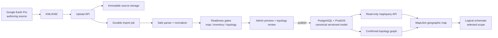

# Audit Fondasi Produk dan Arsitektur SINERGI

Status: audit dasar untuk pengambilan keputusan
Fokus: peta aset dan topologi jaringan
Sumber kajian: proposal magang, source code saat ini, tampilan aplikasi berjalan, dan profil KML aktual
Kerahasiaan: temuan KML hanya disajikan sebagai agregat; nama objek dan koordinat tidak direproduksi

## 1. Kesimpulan utama

SINERGI sebaiknya tidak diposisikan sebagai pengganti Google Earth. Posisi yang
lebih kuat adalah:

> Lapisan intelijen operasional di atas data Google Earth yang membuat aset
> lebih mudah dibaca, dicari, diverifikasi, dan ditelusuri dampak
> keterhubungannya.

Kode saat ini bukan pekerjaan sia-sia. Pipeline upload, pengamanan KML/KMZ,
versioning dasar, dan disiplin test sudah menjadi fondasi yang baik. Namun,
produk belum siap dipresentasikan sebagai "peta yang lebih bernilai daripada
Google Earth" karena:

1. Halaman peta belum menggunakan mesin peta geografis. Koordinat dinormalisasi
   ke canvas, sedangkan jalan, grid, dan label lokasi pada latar digambar statis.
2. KML aktual tidak mempunyai metadata identitas dan relasi yang dibutuhkan
   oleh model produk.
3. Sistem menyamakan "berhasil diparse" dengan "layak digunakan secara
   operasional".
4. Sebagian besar topologi hasil inferensi belum tersambung dan belum cukup
   terpercaya untuk kebutuhan tracing.
5. Elemen visual penting dari sumber, terutama GroundOverlay, belum dirender.
6. Proposal menaruh peta dan topologi sebagai Could Have, padahal arahan GM dan
   pembeda produk justru ada pada dua hal tersebut.

Keputusan yang disarankan:

- hentikan penambahan fitur lebar untuk sementara;
- jadikan peta geografis yang benar sebagai Must Have;
- jadikan tracing topologi terverifikasi sebagai pembeda inti;
- pertahankan Google Earth sebagai authoring tool;
- gunakan web sebagai publication, readability, quality-control, dan
  operational tracing layer;
- keluarkan registrasi, notifikasi, dan integrasi Zabbix dari MVP magang.

## 2. Verdict

### Yang sudah layak dipertahankan

- Pemeriksaan keamanan upload KML/KMZ.
- Pencegahan zip slip, archive bomb, DTD, dan external entity.
- Penyimpanan file sumber immutable dan checksum.
- Dataset version terpisah dan aktivasi terkontrol.
- Pemisahan titik, garis, polygon, dan MultiGeometry.
- Pelestarian urutan longitude-latitude.
- Prinsip tidak mengubah geometri sumber.
- Penggunaan relasi eksplisit terlebih dahulu.
- Topology inference yang menghasilkan diagnostic untuk ambiguous/unresolved.
- Test otomatis: 42 test backend dan 98 test frontend lulus.
- Build dan syntax lint frontend/backend lulus.

### Yang belum boleh diklaim

- Belum dapat diklaim sebagai peta geografis yang lebih baik daripada Google
  Earth.
- Belum dapat diklaim memiliki inventaris terstruktur dari KML aktual.
- Belum dapat diklaim memiliki topologi operasional yang lengkap.
- Belum dapat diklaim sebagai aplikasi production-ready.
- Belum memiliki autentikasi akun sebagaimana proposal; login saat ini hanya
  mengarahkan ke halaman peta.
- Belum memiliki implementasi registrasi, verifikasi akun, dan manajemen user.
- Penyimpanan JSON lokal dan in-memory job queue belum cocok untuk deployment
  multi-instance atau kebutuhan operasional yang durable.

### Status presentasi

- Go: demo sebagai technical prototype import, validation, versioning, dan
  exploratory topology.
- No-go: demo sebagai solusi final "peta yang lebih terbaca dan lebih bernilai
  daripada Google Earth".

## 3. Bukti dari KML aktual

Profil aman terhadap file sumber menghasilkan:

| Indikator | Hasil |
|---|---:|
| Placemark | 1.376 |
| Point | 824 |
| LineString | 552 |
| Folder | 167 |
| Kedalaman folder maksimum | 5 |
| Folder belum terpetakan | 83 |
| Placemark dengan ExtendedData | 0 |
| Placemark dengan Asset ID stabil | 0 |
| Placemark dengan metadata relasi eksplisit | 0 |
| GroundOverlay | 430 referensi |
| LabelStyle yang belum didukung | 104 |

Dengan fallback yang aktif, pipeline tetap menghasilkan 1.376 asset dan
menandai dataset sebagai valid. Namun identitas asset dibentuk dari path folder
dan nama Placemark. Terdapat 1.367 penggunaan fallback identitas dan 9 kasus
yang memerlukan occurrence suffix untuk membedakan nama yang berulang.

Hasil topology inference:

| Indikator | Hasil |
|---|---:|
| Node topologi yang diproses | 449 |
| Edge terkonfirmasi hasil pipeline | 100 |
| Connected component | 359 |
| Node terisolasi | 337 |
| Endpoint belum terselesaikan | 884 |
| Koneksi ambigu | 1 |
| Virtual junction | 157 |

Interpretasi:

- KML valid sebagai dokumen spasial, tetapi belum valid sebagai sumber
  inventaris terstruktur.
- KML dapat ditampilkan di peta, tetapi belum siap menjadi graph topologi
  operasional.
- "Tidak error saat import" bukan indikator bahwa tracing dapat dipercaya.
- GroundOverlay adalah bagian dari konteks visual sumber; mengabaikannya
  membuat hasil web kehilangan informasi yang terlihat di Google Earth.
- Fallback berbasis folder dan nama cocok untuk migrasi awal, tetapi tidak
  cukup stabil sebagai Asset ID jangka panjang.
- Tampilan dataset aktif merangkum 449 node dan 552 line. Dibandingkan dengan
  824 Point pada sumber, ada 375 Point yang tidak masuk ke empat network
  semantic yang ditampilkan. Jika objek tersebut memang visual aid dan bukan
  asset, klasifikasinya harus eksplisit; jika tidak, ini merupakan data yang
  hilang dari pengalaman peta.

## 4. Mengapa produk saat ini terasa kurang tepat

### 4.1 Fokus proposal tidak sama dengan kebutuhan stakeholder

Kebutuhan stakeholder saat ini adalah peta yang lebih terbaca dan topologi.
Proposal justru menjadikan inventaris, akun, import, dan versioning sebagai
Must Have, sedangkan peta/topologi sebagai Could Have.

Akibatnya, implementasi berkembang melebar tetapi "hero workflow" belum kuat.

Hero workflow yang seharusnya:

> Pilih site -> cari atau klik aset -> lihat lokasi dengan jelas -> lihat
> upstream/downstream -> trace jalur -> pahami aset terdampak -> ketahui sumber
> dan tingkat kepercayaan data.

### 4.2 Peta yang ditampilkan bukan peta geografis

Renderer saat ini:

- memproyeksikan seluruh koordinat ke rentang relatif 0,08-0,92;
- menggambar latar jalan dan label lokasi statis di Canvas 2D;
- tidak memiliki tile/basemap geografis;
- tidak memiliki geographic zoom;
- tidak mempertahankan skala jarak ketika longitude-latitude dinormalisasi;
- menggunakan fit global yang dapat membuat site terpisah menjadi sangat kecil;
- tidak merender GroundOverlay dari KML.
- fokus network mengubah camera, tetapi tidak dengan sendirinya mengisolasi
  layer yang difokuskan sehingga manfaat keterbacaannya belum jelas.

Ini bukan sekadar masalah kosmetik. Pengguna dapat mengira posisi objek berada
pada jalan atau bangunan tertentu padahal latar tersebut tidak berasal dari
koordinat yang sama.

### 4.3 Satu status valid mencampur empat makna

Saat ini dataset dapat berstatus valid walaupun tidak memiliki Asset ID stabil,
metadata inventaris, atau topologi yang memadai.

Status perlu dipisah menjadi:

1. `parse_valid`: XML/archive aman dan dapat dibaca.
2. `map_ready`: geometri valid dan dapat ditampilkan pada site yang benar.
3. `inventory_ready`: identitas dan atribut minimum tersedia.
4. `topology_ready`: edge memenuhi aturan confidence dan coverage.
5. `publishable`: memenuhi gate yang dipilih untuk release tersebut.

Contoh: KML aktual dapat `parse_valid=true` dan `map_ready=true`, tetapi
`inventory_ready=false` dan `topology_ready=false`.

### 4.4 Topologi mempunyai false sense of certainty

Inferensi geometri berguna sebagai candidate generator, bukan sebagai sumber
kebenaran tunggal. Garis yang menyentuh titik secara visual belum tentu
menunjukkan koneksi logis. Persilangan dua kabel juga belum tentu merupakan
sambungan.

Setiap edge perlu memiliki:

- `provenance`: explicit metadata, verified spatial inference, atau manual;
- `confidence`: confirmed, candidate, ambiguous, rejected;
- `verified_by` dan `verified_at`;
- alasan pembentukan;
- referensi geometri sumber.

Tracing pengguna hanya boleh melewati edge berstatus confirmed. Candidate
ditampilkan pada mode review administrator, bukan sebagai jalur operasional.

### 4.5 Batas frontend dan backend terbalik

Backend saat ini mengimpor adapter KML dan topology builder dari folder
frontend. Hal ini membuat domain import bergantung pada presentation project.

Target boundary:

```text
packages/domain
  kontrak, validation, canonical model, topology rules

apps/api
  auth, dataset lifecycle, query, publication

apps/worker
  parse, normalize, validate, topology candidate generation

apps/web
  geographic map, schematic, admin review
```

Jika monorepo belum diperlukan, domain dapat dipindahkan ke `backend/src/domain`
dan frontend hanya mengonsumsi API contract. Yang penting, backend tidak
bergantung pada source frontend.

### 4.6 Penyimpanan dan job belum durable

JSON repository dan in-memory queue cukup untuk prototype lokal, tetapi:

- pekerjaan import dapat hilang saat process restart;
- query/filter lintas ribuan asset akan sulit berkembang;
- transaksi antar-entity dan audit akan makin rumit;
- multi-user/multi-instance tidak aman;
- migration dan constraint data belum tersedia.

Untuk pilot operasional, gunakan PostgreSQL dengan PostGIS. File KML/KMZ dan
resource overlay disimpan pada object/file storage immutable. Worker import
harus mempunyai durable job record walaupun eksekusinya masih satu process.

### 4.7 Kompleksitas topology inference

Implementasi saat ini membandingkan line terhadap node dan line terhadap line,
termasuk perbandingan segmen berlapis. Pada data kecil masih dapat diterima,
tetapi target 10.000 objek berisiko menjadi lambat.

Perbaikan:

- jalankan inference sebagai background job;
- gunakan spatial index/bounding-box prefilter;
- gunakan PostGIS/R-tree untuk kandidat;
- proses per site dan per network class;
- simpan hasil sehingga tidak dihitung ulang di browser;
- ukur p95 menggunakan KML representatif, bukan fixture kecil saja.

## 5. Positioning produk yang disarankan

### Pernyataan masalah

Google Earth dapat menampilkan data spasial dengan baik, tetapi tidak secara
khusus menjawab pertanyaan operasional:

- aset ini apa dan status kualitas datanya bagaimana;
- jalur mana yang terhubung;
- jika satu node terganggu, aset mana yang mungkin terdampak;
- versi data mana yang sedang dipercaya;
- perubahan apa yang terjadi sejak publikasi sebelumnya;
- koneksi mana yang confirmed dan mana yang masih perlu diverifikasi.

### Value proposition

SINERGI mengubah KML/KMZ dari visualisasi spasial menjadi peta operasional
terkontrol dengan:

1. keterbacaan berbasis zoom, kategori, prioritas label, dan preset layer;
2. pencarian aset yang langsung memfokuskan peta;
3. topologi confirmed dengan tracing dan impact view;
4. data quality report sebelum publikasi;
5. provenance dan versi aktif yang jelas;
6. peralihan mulus antara geographic map dan logical schematic.

### Demo story yang kuat

1. Buka satu site, bukan seluruh area sekaligus.
2. Tunjukkan peta nyata dengan hanya layer operasional relevan.
3. Cari satu aset.
4. Klik aset dan tampilkan detail minimum.
5. Pilih "Telusuri ke hulu" atau "Lihat dampak".
6. Sorot jalur confirmed, redupkan objek lain.
7. Buka schematic untuk jalur yang sama.
8. Tunjukkan versi aktif dan confidence/provenance.
9. Tunjukkan satu contoh import baru yang ditolak atau dibatasi karena kualitas
   topologi belum memenuhi threshold.

## 6. Scope MVP yang disarankan

### Must Have

- Pemilihan site/cabang.
- Peta geografis read-only dengan basemap yang disetujui perusahaan.
- Point, LineString, Polygon, dan GroundOverlay yang diperlukan.
- Layer preset untuk CCTV, kabel CCTV, fiber optic, LAN, dan infrastruktur.
- Pencarian, filter, zoom-to-feature, dan detail ringkas.
- Label decluttering dan styling berbasis zoom.
- Dataset version aktif dan provenance.
- Import preview dan quality/readiness gate.
- Mapping alias folder.
- Workflow pemberian atau migrasi Asset ID stabil.
- Graph edge dengan confidence/provenance.
- Tracing hanya pada confirmed edge.
- Logical schematic untuk selected asset/selected trace.

### Should Have

- Perbandingan versi pada asset, geometri, dan relation.
- Review queue untuk candidate topology.
- Impact analysis downstream.
- Export hasil filter atau trace.
- Saved view/preset untuk kebutuhan operasi tertentu.

### Won't Have untuk MVP magang

- Registrasi publik dan pengajuan akun.
- Lupa password.
- Manajemen role yang lengkap.
- Zabbix dan notifikasi.
- Editing geometri di web.
- Diagram seluruh site tanpa batas.
- Mobile app.
- Multi-instance deployment.

## 7. Target arsitektur



### Rendering map

MapLibre GL JS cocok untuk geographic map karena menggunakan WebGL, mendukung
GeoJSON/vector-tile source, data-driven styling, dan clustering. Untuk pilot
1.376 objek, GeoJSON per site masih memadai. Vector tiles baru diperlukan jika
volume atau kompleksitas geometri meningkat.

Referensi:

- https://maplibre.org/maplibre-gl-js/docs
- https://maplibre.org/maplibre-gl-js/docs/guides/large-data/

Jangan memakai basemap pihak ketiga sebelum aspek privasi disetujui. Tile
provider dapat mengetahui area yang diminta oleh browser. Untuk data lokasi
sensitif, gunakan provider yang disetujui atau basemap self-hosted/offline.

### Canonical storage

Entitas minimum:

- `site`
- `dataset`
- `dataset_version`
- `source_file`
- `source_feature`
- `asset`
- `asset_geometry`
- `asset_relation`
- `topology_edge`
- `spatial_overlay`
- `layer`
- `import_issue`
- `publication`
- `audit_event`
- `asset_alias`

Geometri sumber dan graph harus dipisah. Garis kabel adalah geometri; edge
topologi adalah hubungan. Satu garis dapat menghasilkan beberapa edge setelah
melewati junction, dan satu edge dapat merujuk ke beberapa geometri.

## 8. Risiko dan mitigasi

| Risiko | Dampak | Mitigasi |
|---|---|---|
| Asset ID tidak stabil | Diff versi salah, relasi putus | Migration mapping dan kontrak Asset ID |
| Folder/nama berubah | Fallback identity berubah | Alias table dan explicit business key |
| Garis berpotongan tetapi tidak terkoneksi | False path | Candidate review, network compatibility rule |
| Endpoint sedikit bergeser | Banyak unresolved | Tolerance per jenis jaringan dan snap review |
| GroundOverlay diabaikan | Konteks sumber hilang | Parse, deduplicate, store, dan render overlay |
| Seluruh site di-fit bersama | Peta tidak terbaca | Scope per site dan geographic camera |
| Basemap eksternal | Kebocoran area akses | Approved/self-hosted basemap |
| Browser menghitung graph besar | UI hang | Precompute di worker/server |
| Import job restart | Status menggantung | Durable job record dan retry |
| Warning terlalu banyak | Admin mengabaikan masalah | Readiness summary dan issue grouping |

## 9. Urutan pengerjaan

### Tahap 0 - keputusan data

- Setujui site pilot dan user scenario utama.
- Setujui Asset ID, kategori, tipe aset, dan cara menyimpan relasi.
- Putuskan GroundOverlay mana yang memang dibutuhkan.
- Tentukan edge compatibility dan tolerance berdasarkan jenis jaringan.
- Buat KML contoh yang sudah dianonimkan untuk automated regression test.

Exit criterion: satu data contract disetujui mentor dan satu site dapat
diklasifikasikan tanpa asumsi diam-diam.

### Tahap 1 - vertical slice peta

- Ganti Canvas map dengan geographic map.
- Tampilkan satu site dan layer penting.
- Implement zoom/search/select/detail.
- Render GroundOverlay yang dibutuhkan.
- Tambahkan label hierarchy dan preset keterbacaan.

Exit criterion: mentor mengakui peta lebih cepat dibaca daripada membuka tree
folder Google Earth untuk skenario yang sama.

### Tahap 2 - trusted topology

- Generate candidate edges.
- Buat review queue.
- Simpan confirmed/rejected decision.
- Implement trace dan impact hanya pada confirmed edge.
- Tampilkan schematic untuk scope terpilih.

Exit criterion: sampel jalur yang disepakati mentor menghasilkan urutan yang
benar dan dapat dijelaskan provenance-nya.

### Tahap 3 - publication governance

- Aktifkan readiness gate.
- Version comparison.
- Atomic publication.
- Audit trail.
- Rollback.

Exit criterion: versi buruk tidak dapat mengganti versi aktif dan perubahan
utama dapat dilihat sebelum publish.

## 10. Acceptance criteria untuk persetujuan mentor

Produk layak dibawa ke mentor jika:

- peta menggunakan referensi geografis yang benar;
- tidak ada latar jalan/lokasi fiktif;
- satu site dapat dibuka langsung;
- point, line, dan overlay penting terlihat pada posisi benar;
- label tidak saling menutupi pada default zoom;
- pencarian memfokuskan asset yang benar;
- detail menyebutkan versi dan provenance;
- tracing tidak melewati candidate/ambiguous edge;
- pengguna dapat membedakan confirmed, candidate, dan unresolved;
- KML tanpa metadata tidak diberi label "fully ready";
- import report merangkum readiness, bukan ribuan warning datar;
- hasil dibandingkan dengan Google Earth pada skenario kerja yang sama.

## 11. Rekomendasi keputusan sekarang

1. Jangan membuang repository.
2. Bekukan fitur Zabbix, akun, notifikasi, dan ekspor lanjutan.
3. Ubah PRD agar map dan topology menjadi fokus Must Have.
4. Ubah status valid menjadi multi-readiness gate.
5. Ganti renderer canvas dengan geographic map.
6. Tambahkan GroundOverlay support terkontrol.
7. Definisikan migration path untuk Asset ID dan relation.
8. Pindahkan domain import/topology keluar dari frontend.
9. Jadikan topology inference sebagai candidate generation di worker.
10. Demonstrasikan satu site dan satu incident journey secara sangat baik,
    bukan seluruh fitur secara setengah matang.
