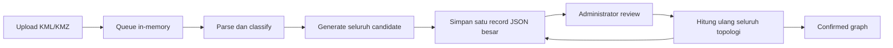
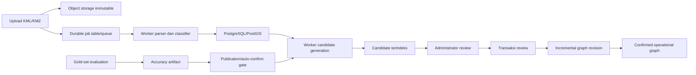
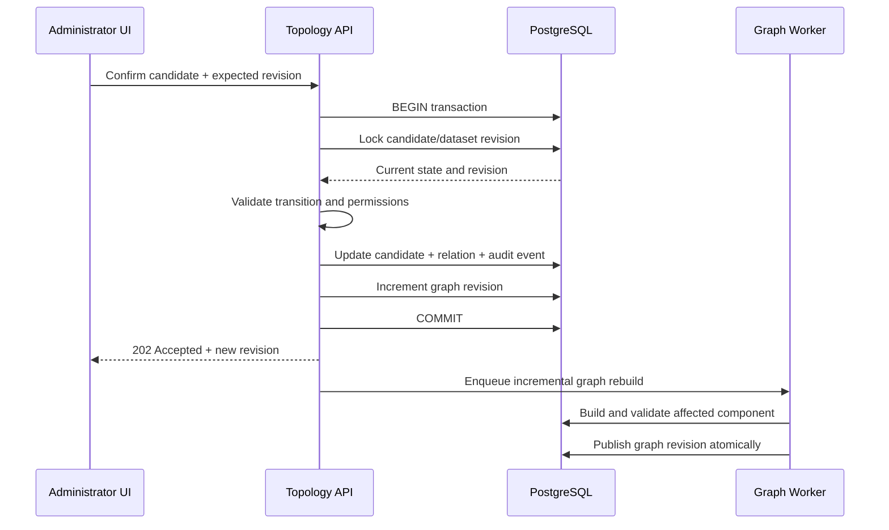
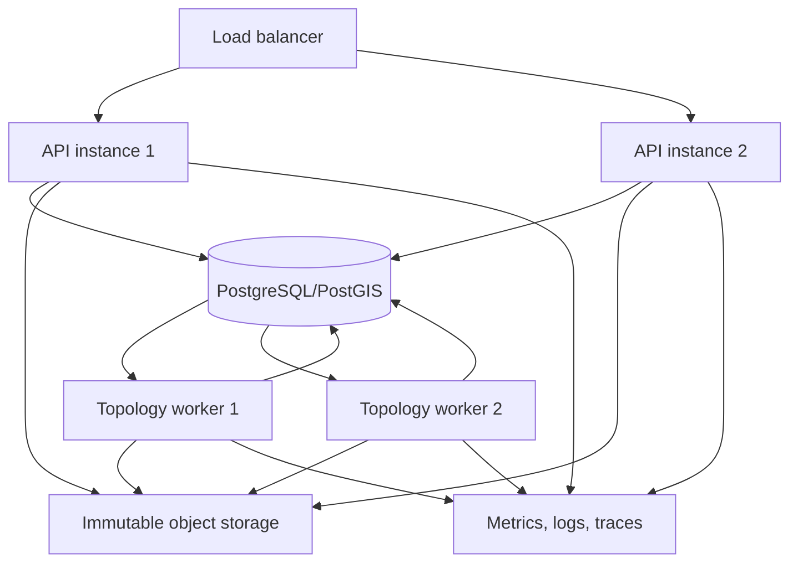

# Rencana Hardening Engine Pengenalan Relasi untuk Skala Enterprise

Status dokumen: `proposed`

Terakhir diperbarui: 4 Agustus 2026

Pemilik keputusan: Product, Backend, Data/GIS, Infrastructure, dan QA

## 1. Ringkasan paling sederhana

Engine relasi saat ini sudah cukup aman untuk pilot karena hasil tebakan spasial
tidak langsung dianggap benar. Hasil tersebut masuk ke antrean kandidat dan
harus dikonfirmasi sebelum dipakai untuk tracing.

Namun, engine belum boleh disebut siap untuk web perusahaan karena:

1. beberapa algoritme masih membandingkan banyak data satu per satu;
2. satu aksi review dapat menghitung ulang seluruh topologi;
3. dua reviewer yang bekerja bersamaan dapat saling menimpa perubahan;
4. antrean pekerjaan hilang jika proses server restart;
5. data masih disimpan sebagai file JSON, bukan database terindeks;
6. nilai akurasi produksi belum terikat langsung pada hasil gold set yang sah;
7. belum ada bukti load test pada 10.000 sampai 50.000 objek.

Kesimpulan status:

- `GO` untuk pilot terkontrol dengan review Administrator.
- `NO-GO` untuk auto-confirm massal.
- `NO-GO` untuk deployment multi-instance dan beban enterprise.

## 2. Istilah yang dipakai

| Istilah | Arti sederhana |
|---|---|
| Node | Perangkat, misalnya kamera, switch, junction box, atau OTB |
| Path | Jalur kabel atau LineString |
| Candidate | Relasi yang ditemukan engine tetapi belum dipercaya |
| Confirmed relation | Relasi yang sudah disetujui policy yang sah atau manusia |
| Operational graph | Graph yang hanya berisi relasi confirmed dan boleh dipakai tracing |
| Gold set | Contoh relasi yang sudah diberi label benar/salah oleh manusia |
| Rule set | Versi aturan, threshold, dan bobot yang digunakan engine |
| Graph revision | Identitas versi graph setelah terjadi perubahan |
| Durable job | Pekerjaan yang tetap tercatat setelah server restart |
| Idempotent | Pekerjaan aman dijalankan ulang tanpa membuat hasil ganda |
| Spatial index | Indeks untuk mencari objek yang lokasinya berdekatan tanpa memindai semua data |

## 3. Sasaran dan batas pekerjaan

### 3.1 Sasaran

Setelah hardening selesai, sistem harus:

- aman menerima dataset besar;
- dapat dijalankan pada lebih dari satu instance;
- tidak kehilangan review atau job;
- tidak memasukkan kandidat yang belum confirmed ke graph operasional;
- memberikan hasil deterministik untuk input dan rule set yang sama;
- mengikat auto-confirm pada hasil evaluasi akurasi yang dapat diaudit;
- dapat dipantau, diulang, dibatalkan, dan di-rollback;
- tetap responsif saat Administrator melakukan review.

### 3.2 Bukan sasaran fase ini

- membuat model AI generatif untuk menentukan relasi;
- mengubah source geometry agar terlihat tersambung;
- menghilangkan kebutuhan review sebelum accuracy gate terbukti;
- menyatukan semua network family tanpa aturan kompatibilitas;
- menganggap garis yang berpotongan pasti terhubung.

## 4. Kondisi saat ini

### 4.1 Hal yang sudah benar

- [x] Hanya relasi `confirmed` yang masuk operational graph.
- [x] Spatial inference default menjadi candidate.
- [x] Candidate ambiguous tidak otomatis masuk graph.
- [x] Intersection membutuhkan classified junction evidence.
- [x] Source geometry tidak dimodifikasi oleh inference.
- [x] Dataset version dan rule-set version disimpan.
- [x] Candidate memiliki score, margin, evidence, dan deterministic ID.
- [x] Confirm, reject, skip, select-target, revoke, dan audit event tersedia.
- [x] Readiness bersifat fail-closed ketika akurasi belum terbukti.
- [x] Backend test lulus: 85 dari 85 pada audit 3 Agustus 2026.
- [x] Backend lint lulus pada audit 3 Agustus 2026.
- [x] Backend build lulus pada audit 3 Agustus 2026.

### 4.2 Hal yang belum memenuhi enterprise

- [x] Tidak ada perbandingan semua pasangan path pada jalur utama.
- [x] Review satu candidate tidak menghitung ulang seluruh dataset pada
  in-process incremental rebuild contract; API/worker SLO masih pending.
- [x] Review concurrent bebas lost update pada JSON repository contract;
  PostgreSQL/multi-instance production masih pending.
- [x] Live PostgreSQL service restart/recovery probe lulus: readiness kembali,
  durable probe selesai, dan enqueue ulang ter-deduplicate; import/inference
  production replay masih pending.
- [x] Job import dan inference bertahan setelah restart pada durable JSON dan
  local PostgreSQL process-recovery contract; production replay masih pending.
- [x] Candidate dan relation disimpan pada tabel terindeks pada local PostgreSQL
  pilot; production-sized query/SLO masih pending.
- [x] API candidate memakai pagination dan filter server-side.
- [x] Accuracy gate berasal dari evaluation artifact, bukan angka environment;
  runtime contract selesai, tetapi artifact/evaluator production masih pending.
- [ ] Load test 10.000 objek lulus pada worker/API production target;
  sparse in-process guardrail lulus pada Checkpoint 46.
- [ ] Load test 50.000 objek lulus atau mempunyai batas kapasitas resmi.
- [x] Recovery, retry, timeout, dan dead-letter job telah diuji pada local
  durable/recovery contract; production failure drill masih pending.
- [ ] Dashboard metrik dan alert produksi tersedia.

## 5. Alur sistem

### 5.1 Alur saat ini



Masalah utamanya adalah queue tidak durable, data tidak terindeks, dan review
memanggil full regeneration pada request interaktif.

### 5.2 Alur target



### 5.3 Alur review yang aman



Jika `expected revision` berbeda dari revision database, API harus menjawab
`409 Conflict`. UI kemudian memuat state terbaru sebelum mengulangi aksi.

## 6. Solusi teknis per masalah

### 6.1 Ganti file JSON dengan PostgreSQL dan PostGIS

File KML/KMZ tetap disimpan secara immutable pada object storage atau file
storage yang mempunyai backup. Entity operasional dipindahkan ke database.

Tabel minimum:

```text
dataset_versions
source_features
source_geometries
classified_objects
topology_jobs
topology_candidates
confirmed_relations
graph_revisions
graph_nodes
graph_edges
accuracy_evaluations
audit_events
```

Constraint minimum:

```text
UNIQUE(dataset_version_id, candidate_id)
UNIQUE(dataset_version_id, relation_id)
UNIQUE(dataset_version_id, canonical_asset_id)
FOREIGN KEY candidate.dataset_version_id -> dataset_versions.id
FOREIGN KEY relation.candidate_id -> topology_candidates.id
CHECK candidate_status IN (...controlled states...)
CHECK verification_status IN ('confirmed', 'revoked')
```

Indeks minimum:

```text
GIST(source_geometries.geometry)
BTREE(topology_candidates.dataset_version_id, candidate_status, score DESC)
BTREE(topology_candidates.source_endpoint_id)
BTREE(confirmed_relations.dataset_version_id, verification_status)
BTREE(topology_jobs.status, available_at)
BTREE(audit_events.dataset_version_id, occurred_at)
```

Checklist:

- [x] Schema migration dibuat, dapat di-rollback melalui migration runner, dan
  sudah diterapkan pada local PostgreSQL/PostGIS target; production apply tetap
  pending.
- [x] Foreign key dan unique constraint diuji pada local PostgreSQL live schema
  melalui `npm run db:constraint-negative`; production rollout tetap pending.
- [x] Data JSON pilot berhasil dimigrasikan tanpa kehilangan
  candidate/relation pada local PostgreSQL pilot.
- [x] Jumlah node, edge, candidate, dan audit event sebelum/sesudah sama pada
  pilot parity; negative constraint test live masih pending.
- [x] Backup dan restore database pilot lulus ke database sementara yang bersih;
  production disaster-recovery sign-off masih pending.

### 6.2 Hilangkan perbandingan semua pasangan path

Jangan membandingkan setiap path dengan setiap path. Gunakan langkah berikut:

1. simpan bounding box setiap geometry;
2. cari hanya bounding box yang berpotongan menggunakan PostGIS/R-tree;
3. filter berdasarkan site dan network family;
4. baru lakukan pemeriksaan segmen presisi;
5. simpan pasangan yang sudah diperiksa agar tidak dihitung dua kali.

Query konseptual:

```sql
SELECT a.id, b.id
FROM source_geometries a
JOIN source_geometries b
  ON a.id < b.id
 AND a.dataset_version_id = b.dataset_version_id
 AND a.site_id = b.site_id
 AND a.network_family = b.network_family
 AND ST_Intersects(ST_Envelope(a.geometry), ST_Envelope(b.geometry));
```

Untuk junction, gunakan pencarian radius spasial. Jangan melakukan
`allNodes.filter(...)` untuk setiap intersection.

```sql
SELECT id
FROM classified_objects
WHERE dataset_version_id = $1
  AND object_role = 'device_node'
  AND ST_DWithin(location::geography, $intersection::geography, $radius);
```

Checklist:

- [x] Pair generation memakai spatial index pada engine in-process; query plan
  PostGIS pilot live lulus, sedangkan workload production-sized tetap pending.
- [x] Junction lookup memakai radius query terindeks pada engine in-process;
  query plan PostGIS pilot live lulus, sedangkan workload production-sized
  tetap pending.
- [x] Tidak ada nested loop global path × path pada engine spatial-prefilter;
  production-sized profiling tetap pending.
- [x] Hasil candidate sama dengan engine lama pada regression fixture.
- [x] Runtime bertambah mendekati linear pada dataset sparse benchmark; SLO
  enterprise tetap pending.

### 6.3 Buat review dan graph rebuild incremental

Review satu candidate hanya boleh memengaruhi:

- candidate yang dipilih;
- alternative candidate untuk endpoint yang sama;
- relation yang dihasilkan;
- komponen graph yang menyentuh source/target tersebut;
- summary counter yang terkait.

Full regeneration tetap tersedia sebagai job administratif, bukan bagian dari
request normal confirm/reject/revoke.

Checklist:

- [x] Confirm candidate tidak menjalankan full candidate generation pada
  in-process incremental rebuild contract; API/worker SLO masih pending.
- [x] Reject/skip tidak membangun ulang komponen yang tidak berubah pada
  in-process scope contract; production profiling masih pending.
- [x] Revoke hanya menghitung ulang affected component pada in-process scope
  contract; production profiling masih pending.
- [x] Full regeneration berjalan sebagai durable background job pada durable
  JSON queue; PostgreSQL multi-instance production masih pending.
- [x] Graph revision berubah tepat satu kali untuk satu transaksi sukses pada
  durable JSON regeneration contract; PostgreSQL multi-instance masih pending.
- [x] Graph lama tetap aktif sampai artifact full-regeneration tervalidasi;
  review mutation dan PostgreSQL multi-instance publication masih pending.

### 6.4 Cegah lost update

Setiap mutasi harus membawa:

```json
{
  "expectedGraphRevision": "revision-123",
  "expectedCandidateStatus": "candidate"
}
```

Update harus terjadi dalam satu transaksi database. Salah satu pendekatan:

```sql
UPDATE topology_candidates
SET candidate_status = 'confirmed', revision = revision + 1
WHERE candidate_id = $1
  AND candidate_status = 'candidate'
  AND revision = $2;
```

Jika jumlah row yang berubah `0`, operasi dianggap stale dan API mengembalikan
`409 Conflict`.

Candidate update, confirmed relation, graph revision, dan audit event harus
berhasil atau gagal bersama-sama.

Checklist:

- [x] Optimistic concurrency diterapkan pada candidate dan graph revision.
- [x] Audit event berada dalam transaksi yang sama dengan perubahan state.
- [x] Dua reviewer pada candidate yang sama menghasilkan satu pemenang.
- [x] Dua reviewer pada candidate berbeda tidak saling menghapus perubahan;
  contract test JSON lulus.
- [x] Retry setelah network timeout tidak menghasilkan relation ganda pada
  contract JSON/HTTP untuk confirm, select-target, manual relation, revoke,
  dan bulk review; PostgreSQL disconnect retry untuk single confirm juga lulus.

### 6.5 Gunakan durable job

Job minimum:

```text
parse_source
classify_objects
generate_candidates
rebuild_graph_component
regenerate_full_topology
evaluate_accuracy
publish_dataset
```

State machine:

```text
queued -> running -> succeeded
queued -> running -> retry_wait -> running
queued -> running -> failed
failed -> dead_letter
```

Setiap job menyimpan:

```text
job_id
job_type
dataset_version_id
input_fingerprint
status
attempt_count
max_attempts
available_at
locked_by
lock_expires_at
started_at
completed_at
error_code
error_summary
```

Idempotency key yang disarankan:

```text
SHA256(job_type + dataset_version_id + input_fingerprint + rule_set_version)
```

Checklist:

- [x] Job tetap tersedia setelah API/worker restart pada durable JSON queue dan
  replacement process PostgreSQL memulihkan lease live; database disconnect dan
  production recovery tetap pending.
- [x] Worker yang mati tidak meninggalkan job terkunci selamanya pada durable
  queue contract; production worker fleet tetap pending.
- [x] Retry memakai exponential backoff dan maksimum percobaan pada durable
  queue contract; PostgreSQL production load/retry drill tetap pending.
- [x] Poison job masuk dead-letter queue dan dapat diulang Administrator pada
  durable queue/API contract; alerting dan production retention tetap pending.
- [x] Job yang sama tidak membuat artifact ganda pada idempotent durable
  regeneration contract; production worker load masih pending.
- [x] API dapat menampilkan progress job, termasuk job
  `regenerate_full_topology`; p95 production masih pending.
- [x] Operator dapat retry atau cancel melalui durable job API contract; policy
  dan drill production masih pending.

### 6.6 Ikat accuracy gate pada artifact yang sah

Auto-confirm tidak boleh membaca angka bebas seperti:

```text
HELD_OUT_PRECISION=0.99
PATH_ACCURACY=0.95
```

Sebagai gantinya, gunakan `accuracy_evaluation` yang mempunyai:

```text
evaluation_id
dataset/site scope
gold_set_version
gold_set_checksum
rule_set_version
engine_build_sha
sample_size
held_out_precision
held_out_recall
path_accuracy
component_accuracy
false_component_merge_count
evaluated_at
approved_by
approved_at
status
```

Auto-confirm hanya terbuka jika seluruh kondisi benar:

```text
evaluation.status = approved
evaluation.rule_set_version = active rule set
evaluation.gold_set_checksum = approved gold set checksum
held_out sample size memenuhi minimum
held_out precision >= 0.99
path accuracy >= 0.95
false component merge = 0
evaluation belum kedaluwarsa
scope site/network family cocok
```

Perubahan bobot, radius, compatibility matrix, parser, classifier, atau semantic
mapping harus membatalkan approval lama dan memerlukan evaluasi baru.

Checklist:

- [ ] Gold set berisi minimal 200–300 endpoint representatif.
- [ ] Minimal 20 path end-to-end diverifikasi.
- [ ] Calibration dan held-out benar-benar terpisah.
- [ ] Gold set mempunyai checksum dan version.
- [x] Evaluasi terikat pada rule set dan build SHA pada runtime gate; durable
  evaluation artifact production masih pending.
- [x] Auto-confirm gagal tertutup jika artifact hilang, stale, atau tidak cocok;
  regression evidence tersimpan pada Checkpoint 44.
- [ ] Akurasi dilaporkan per site dan network family.
- [ ] False-positive dan false-negative dapat ditelusuri ke candidate evidence.

Checkpoint 44 mengimplementasikan enforcement contract di atas. Checklist gold
set production, durable evaluation, persistence/signature artifact, dan approval
organisasi tetap harus selesai sebelum status enterprise atau GO auto-confirm
diubah.

### 6.7 Pagination dan kontrak API

Endpoint candidate target:

```http
GET /api/dataset-versions/:id/topology/candidates
  ?status=ambiguous
  &networkFamily=fiber_optic
  &minScore=0.55
  &cursor=opaque-cursor
  &limit=100
```

Response:

```json
{
  "items": [],
  "nextCursor": null,
  "summary": {
    "candidate": 0,
    "ambiguous": 0,
    "confirmed": 0
  },
  "graphRevision": "revision-123"
}
```

Aturan:

- `limit` default 100 dan maksimum 500;
- cursor harus stabil terhadap urutan `score DESC, candidate_id ASC`;
- detail evidence besar boleh dimuat melalui endpoint detail;
- endpoint graph mendukung revision/ETag;
- response tidak mengirim seluruh history tanpa pagination.

Checklist:

- [x] Candidate API memakai cursor pagination.
- [x] Filter status/site/family/score terindeks.
- [x] Response maksimal mempunyai batas ukuran.
- [x] ETag atau graph revision mendukung cache.
- [x] UI tetap benar ketika data berubah di antara dua halaman.

## 7. Arsitektur deployment target



Aturan deployment:

- API tidak menjalankan inference berat pada event loop request;
- worker boleh diskalakan terpisah dari API;
- satu dataset version hanya mempunyai satu full-regeneration aktif;
- rebuild komponen boleh paralel jika component lock berbeda;
- artifact baru dipublikasikan setelah validation berhasil;
- graph revision lama tetap dapat dibaca selama rollout revision baru.

## 8. Observability dan alert

Metrik minimum:

```text
topology_job_duration_seconds{job_type,status}
topology_job_queue_depth{job_type}
topology_candidate_count{status,site,network_family}
topology_review_duration_seconds{action}
topology_review_conflict_total
topology_graph_rebuild_duration_seconds{mode}
topology_graph_validation_error_total{issue_code}
topology_unresolved_endpoint_total{site,network_family}
topology_auto_confirm_total{rule_set_version}
topology_auto_confirm_blocked_total{reason}
topology_api_request_duration_seconds{route,status}
```

Alert minimum:

- queue tertua melewati SLO;
- job gagal berulang atau masuk dead-letter;
- graph validation error lebih dari nol;
- jumlah unresolved naik tajam setelah rule-set change;
- candidate count berubah di luar batas regression;
- accuracy artifact expired;
- auto-confirm aktif tanpa evaluation approval;
- review conflict atau error rate melonjak;
- database replication/backup bermasalah.

Checklist:

- [x] Protected `/metrics` menyediakan local HTTP request count/latency/error,
  in-flight, dan process resource metrics; endpoint fail-closed ketika tidak
  diaktifkan dan membutuhkan Administrator ketika aktif.
- [x] Durable queue melaporkan local job transition, duration,
  deduplication/dead-letter, worker active, dan queue depth; aggregation
  multi-instance production tetap pending.
- [ ] Dashboard import dan topology job tersedia.
- [ ] Dashboard kualitas candidate tersedia.
- [ ] Dashboard latency API/review tersedia.
- [ ] Alert diuji dengan fault injection sederhana.
- [x] Audit event HTTP/worker/service mempunyai correlation ID, dataset version,
  job ID, dan graph revision bila context tersebut berlaku; centralized log
  shipping dan retention production tetap pending.
- [x] HTTP request correlation ID dipantulkan pada response dan disimpan pada
  audit event HTTP yang sudah berada di boundary app.
- [ ] Log tidak menyimpan token, password, atau source data sensitif berlebihan.

## 9. Target nonfungsional yang harus disetujui

Angka berikut adalah target awal, bukan bukti bahwa sistem sudah mencapainya.
Product dan Infrastructure harus mengesahkan angka final.

| Area | Target awal |
|---|---|
| Dataset pilot | 10.000 objek |
| Dataset stress | 50.000 objek |
| API candidate list p95 | kurang dari 500 ms |
| Confirm/reject API p95 | kurang dari 1 detik sampai transaksi diterima |
| Full regeneration 10k | kurang dari 60 detik di worker target |
| Lost review | 0 |
| Job hilang setelah restart | 0 |
| Duplicate relation akibat retry | 0 |
| Held-out precision auto-confirm | minimal 99% |
| Path accuracy | minimal 95% |
| False component merge | 0 pada approved held-out set |
| Availability API | sesuai SLO perusahaan, usulan awal 99,9% |

## 10. Checklist pengujian

Checklist baru boleh ditandai `[x]` jika evidence disimpan dalam CI artifact,
test report, benchmark report, atau audit record.

### 10.1 Unit test aturan relasi

- [x] Endpoint-device spatial inference tetap candidate secara default.
- [x] Candidate ambiguous tidak masuk confirmed graph.
- [x] Crossing line tanpa junction tidak terhubung.
- [x] Classified junction menghasilkan reviewable candidate.
- [x] Invalid geometry tidak masuk candidate generation.
- [x] Mixed dataset version ditolak.
- [x] Duplicate dan zero-length linework didiagnosis.
- [x] Explicit metadata dangling tidak menghasilkan dangling graph edge.
- [x] Revoked relation tidak masuk operational graph.
- [x] Property test: urutan input tidak mengubah output.
- [x] Property test: menjalankan job dua kali menghasilkan artifact yang sama
  pada input/rule-set/generation time yang sama.
- [x] Fuzz test geometry ekstrem, sangat panjang, dan koordinat dekat batas
  dunia pada deterministic corpus.
- [x] Rule-set compatibility matrix diuji untuk seluruh pasangan family
  representative.

### 10.2 Integration test

- [x] Import KML/KMZ sampai candidate generation berjalan.
- [x] Candidate review membentuk confirmed graph.
- [x] Revoke mengubah graph revision dan tracing.
- [x] Trace hanya memakai confirmed graph.
- [x] PostgreSQL transaction mencakup review, relation, revision, dan audit;
  live production-sized HTTP replay masih pending.
- [ ] Object storage, database, API, dan worker diuji end-to-end.
- [x] Pagination candidate diuji melintasi beberapa halaman.
- [ ] Aktivasi dataset tidak menampilkan graph setengah jadi.
- [x] Rollback rule set mengaktifkan kembali graph revision/pointer dataset
  yang benar pada lifecycle contract.

### 10.3 Accuracy test

- [x] Fungsi evaluator melaporkan precision, recall, coverage, path accuracy,
  component accuracy, dan false component merge pada fixture unit.
- [ ] Gold set 200–300 endpoint selesai dilabeli.
- [ ] Minimal 20 path end-to-end selesai diverifikasi.
- [ ] Tidak ada endpoint held-out yang bocor ke calibration/tuning.
- [ ] Precision per distance stratum dilaporkan.
- [ ] Precision per site dan network family dilaporkan.
- [ ] False-negative review dilakukan, bukan hanya false-positive.
- [ ] Accuracy artifact production ditandatangani/di-approve.
- [ ] Rule change otomatis membuat evaluation lama stale.

### 10.4 Concurrency test

- [x] Concurrent dataset activation mempunyai lock pada repository saat ini.
- [x] 20 reviewer mengubah candidate berbeda tanpa lost update pada JSON
  repository contract; HTTP/PostgreSQL load masih pending.
- [x] Dua reviewer mengubah candidate sama: satu sukses, satu menerima 409.
- [x] Confirm dan revoke bersamaan menghasilkan state machine yang valid pada
  JSON repository contract; HTTP/PostgreSQL load masih pending.
- [x] Full regeneration dan review bersamaan tidak menghapus keputusan review
  pada JSON repository contract; HTTP/PostgreSQL/worker race masih pending.
- [x] Retry request dengan idempotency key tidak membuat audit/relation ganda
  pada JSON/HTTP contract untuk single-candidate, bulk, select-target, manual
  relation, dan revoke, termasuk concurrent same-key manual relation; PostgreSQL
  disconnect-before-commit retry untuk single confirm juga lulus. PostgreSQL
  server failover, retry lintas instance, serta multi-instance production masih
  pending.
- [x] Dua worker tidak mengambil job yang sama pada JSON multi-repository
  claim contract; PostgreSQL multi-instance masih pending.
- [x] Worker lock yang expired dapat diambil alih dengan aman pada uji
  lintas-process durable JSON queue dan replacement process PostgreSQL live;
  multi-worker production masih pending.

### 10.5 Performance dan load test

Dataset uji harus mempunyai beberapa bentuk:

1. `sparse`: objek tersebar dan sedikit kandidat;
2. `dense`: banyak objek dalam radius kecil;
3. `intersection-heavy`: banyak line crossing;
4. `long-lines`: sedikit path tetapi banyak segmen;
5. `ambiguous-heavy`: banyak kandidat dengan score berdekatan;
6. `confirmed-graph-heavy`: graph besar dengan banyak cabang dan siklus.

Checklist:

- [x] Benchmark sintetis awal 1.000, 2.000, dan 4.000 path dicatat pada audit
  3 Agustus 2026.
- [x] Benchmark mempunyai fixture dan command yang tersimpan di repository.
- [ ] 10.000 objek sparse memenuhi SLO.
- [ ] 10.000 objek dense memenuhi SLO atau mempunyai guardrail resmi.
- [x] 50.000 objek pada guarded sparse in-process stress test tidak menyebabkan
  out-of-memory; dense dan production capacity/SLO tetap pending.
- [ ] Candidate API p95 memenuhi target pada concurrent traffic.
- [ ] Review API p95 memenuhi target saat worker sedang sibuk.
- [ ] Query plan membuktikan spatial/BTREE index digunakan.
- [x] Candidate explosion mempunyai hard limit dan diagnostic yang jelas.
- [x] Timeout tidak meninggalkan partial artifact pada engine generation.
- [ ] Memory, CPU, database I/O, dan queue depth dilaporkan.

### 10.6 Recovery dan durability test

- [x] Restart API saat upload tidak menghilangkan job pada process-level
  durable JSON test; PostgreSQL process-level durable job recovery live juga
  lulus pada fixture lease.
- [x] Restart worker saat inference membuat job diulang dengan aman pada uji
  lintas-process durable JSON queue; replacement process PostgreSQL live juga
  memulihkan lease dan menyelesaikan job yang sama.
- [x] Database disconnect menghasilkan retry tanpa duplicate relation pada
  isolated PostgreSQL mutation probe; local PostgreSQL service recovery probe
  juga lulus, sedangkan production failover dan retry lintas instance masih
  pending.
- [x] Object storage unavailable menghasilkan error yang dapat ditindaklanjuti
  pada adapter source storage saat ini.
- [x] Dead-letter job dapat diperiksa dan di-retry.
- [x] Backup database pilot berhasil di-restore ke environment bersih sementara
  dan seluruh projection count sama; production DR masih pending.
- [x] Graph revision sebelumnya dapat diaktifkan kembali pada lifecycle
  contract.
- [x] Audit event tetap konsisten setelah disconnect-before-commit retry pada
  isolated PostgreSQL mutation probe; broader transaction-failure matrix masih
  pending.

### 10.7 Security dan governance test

- [x] Endpoint mutasi Administrator menolak user biasa pada test saat ini.
- [x] Archive path traversal dan unsafe XML ditolak.
- [ ] SSO/RBAC perusahaan menggantikan static token untuk production.
- [ ] Hak akses dipisahkan antara viewer, reviewer, publisher, dan operator.
- [ ] Semua mutation mempunyai actor, reason, time, dan correlation ID.
- [ ] Audit log bersifat append-only dan mempunyai retention policy.
- [ ] Dataset/site isolation diuji.
- [ ] Rate limit upload, review, tracing, dan regeneration diuji.
- [ ] Dependency dan container security scan menjadi bagian CI.

## 11. Tahapan implementasi

### Fase 0 — Kunci baseline

- [ ] Simpan fixture pilot yang sudah dianonimkan.
- [ ] Simpan output node/edge/candidate sebagai golden snapshot.
- [ ] Simpan benchmark script dan laporan baseline.
- [ ] Setujui target kapasitas dan SLO.
- [ ] Bekukan controlled vocabulary dan rule-set version saat migrasi.

Exit criterion:

- hasil lama dapat direproduksi;
- setiap perubahan berikutnya dapat dibandingkan secara objektif.

### Fase 1 — Database dan durable job

- [x] Buat schema PostgreSQL/PostGIS; migration dan local live apply sudah
  dibuktikan, production rollout tetap pending.
- [x] Buat repository adapter baru dengan contract test; wiring PostgreSQL
  primary, migration, parity, dan shadow compare sudah lulus.
- [x] Buat durable job worker dengan repository PostgreSQL pada mode primary.
- [x] Migrasikan satu dataset pilot.
- [x] Jalankan shadow read/compare tanpa publikasi.

Catatan checkpoint runtime (4 Agustus 2026): mode `postgres` memilih
`PostgresDatasetVersionRepository`, `PostgresDurableJobRepository`, dan
`PostgresAuditLog`; live primary pilot membuktikan create/update, claim/complete,
dan `jsonPrimaryUsed: false`. Mode `shadow` tetap tersedia untuk compare.

Catatan 5 Agustus 2026: shadow pilot membandingkan `list` pada scope fixture
`dv-pilot-parity`, bukan seluruh database PostgreSQL yang dapat memuat dataset
dan audit evidence lain. Mismatch nyata sekarang fail-closed dengan exit
non-zero; live rerun scoped setelah perubahan lulus dengan `equal=true`.

Exit criterion:

- restart tidak menghilangkan job;
- jumlah data hasil migrasi konsisten;
- API lama dan adapter baru menghasilkan output kontrak yang sama.

### Fase 2 — Spatial dan performance hardening

- [x] Ganti path-pair scan dengan spatial prefilter.
- [x] Ganti global junction scan dengan indexed radius query.
- [ ] Optimalkan degree, validation, dan component calculation.
- [x] Tambahkan guardrail candidate explosion.
- [ ] Jalankan load test 10.000 objek.

Exit criterion:

- target 10.000 objek memenuhi SLO yang disetujui;
- regression fixture tidak berubah tanpa approval.

### Fase 3 — Transactional review dan incremental graph

- [x] Tambahkan optimistic revision.
- [x] Satukan state change dan audit dalam transaksi; live HTTP replay pilot
  lulus, sedangkan multi-reviewer load masih pending.
- [x] Implement incremental component rebuild; API/worker SLO dan production
  profiling masih pending.
- [x] Tambahkan pagination candidate.
- [x] Jalankan repository concurrency test; API-level multi-reviewer load masih
  pending.

Exit criterion:

- lost update = 0;
- duplicate relation akibat retry = 0;
- review interaktif memenuhi SLO.

### Fase 4 — Accuracy dan publication gate

- [ ] Selesaikan gold set.
- [ ] Integrasikan accuracy evaluator ke durable job.
- [ ] Simpan dan approve accuracy artifact.
- [ ] Ikat artifact ke rule set, site, family, dan build SHA.
- [x] Uji fail-closed untuk artifact stale/missing pada runtime contract;
  production evaluation approval masih pending.

Exit criterion:

- angka akurasi memenuhi threshold;
- auto-confirm tidak dapat aktif melalui environment flag saja.

### Fase 5 — Production readiness

- [ ] Dashboard dan alert selesai.
- [ ] Backup/restore dan disaster recovery diuji.
- [ ] Security review selesai.
- [ ] Canary pada satu site selesai.
- [ ] Runbook operator dan incident response tersedia.

Exit criterion:

- seluruh critical checklist lulus;
- Product, Engineering, GIS/Data, QA, Security, dan Operations memberi sign-off.

## 12. Strategi rollout dan rollback

### Rollout

1. Jalankan engine lama dan baru pada input yang sama dalam shadow mode.
2. Bandingkan candidate, confirmed relation, graph component, dan unresolved.
3. Selidiki setiap perbedaan sebelum publikasi.
4. Aktifkan database baru untuk read-only candidate UI.
5. Aktifkan transactional review pada satu site pilot.
6. Aktifkan incremental graph rebuild.
7. Aktifkan lebih banyak site secara bertahap.
8. Auto-confirm tetap mati sampai accuracy gate disetujui.

### Rollback

Rollback tidak menghapus data baru. Sistem harus:

- menghentikan worker versi baru;
- mengembalikan active graph pointer ke revision terakhir yang valid;
- mempertahankan seluruh audit event;
- menandai job yang belum selesai sebagai paused/retryable;
- menonaktifkan auto-confirm;
- tetap menyediakan mode map-only bila topology tidak siap.

Checklist:

- [x] Rollback graph pointer diuji pada lifecycle contract.
- [x] Rollback aplikasi tidak membutuhkan rollback data destruktif pada
  lifecycle contract.
- [ ] Candidate yang direview selama canary tidak hilang.
- [ ] Runbook rollback dapat dijalankan operator selain developer utama.

## 13. Go/No-Go gate

### GO pilot

Pilot boleh berjalan jika:

- semua inference tetap candidate;
- hanya confirmed relation dipakai tracing;
- satu Administrator melakukan review terkontrol;
- backup tersedia;
- keterbatasan sistem ditampilkan kepada pengguna.

### GO enterprise manual-review

Enterprise manual-review baru boleh berjalan jika:

- PostgreSQL/PostGIS dan durable job aktif;
- concurrency test lulus;
- 10.000-object load test lulus;
- pagination dan observability aktif;
- recovery test lulus;
- security sign-off selesai.

### GO auto-confirm

Auto-confirm baru boleh berjalan jika seluruh kondisi enterprise manual-review
lulus, ditambah:

- approved held-out precision minimal 99%;
- approved path accuracy minimal 95%;
- false component merge = 0;
- evaluation artifact cocok dengan rule set/build/site/family aktif;
- Product, GIS/Data, dan Risk Owner memberi approval.

### NO-GO otomatis

Deployment harus dihentikan atau kembali ke map-only jika:

- candidate yang belum confirmed masuk graph;
- graph validation mempunyai error;
- ditemukan lost update;
- job hilang setelah restart;
- accuracy artifact missing/stale tetapi auto-confirm aktif;
- rollback revision gagal;
- audit trail tidak konsisten.

## 14. Definition of Done

Engine baru dianggap enterprise-ready hanya jika:

- [ ] Seluruh checklist critical pada database, job, concurrency, dan recovery lulus.
- [ ] Tidak ada full regeneration pada request review normal.
- [ ] Tidak ada global path-pair dan intersection-node scan.
- [ ] Load test representatif memenuhi SLO yang disetujui.
- [ ] Accuracy gate memakai approved versioned artifact.
- [x] Candidate API terindeks dan terpaginasikan.
- [ ] Setiap perubahan menghasilkan audit dan graph revision yang konsisten.
- [ ] Multi-instance API dan worker diuji.
- [ ] Backup, restore, rollout, dan rollback diuji.
- [ ] Runbook serta dashboard tersedia.
- [ ] Semua sign-off organisasi selesai.

Sampai seluruh kondisi tersebut terpenuhi, label produk yang benar adalah:

> Engine relasi pilot dengan fail-safe manual review, belum engine auto-relation
> enterprise production.
