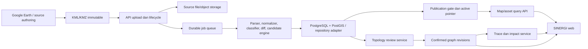
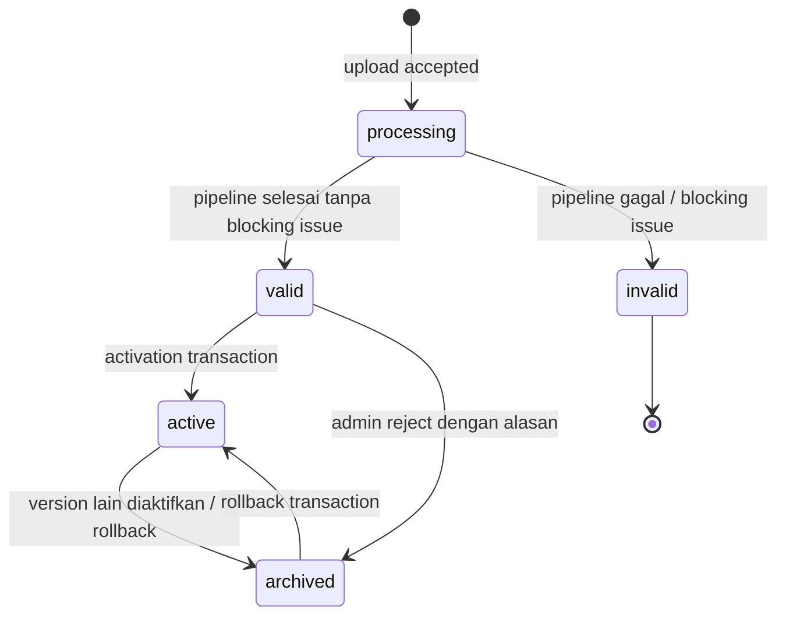
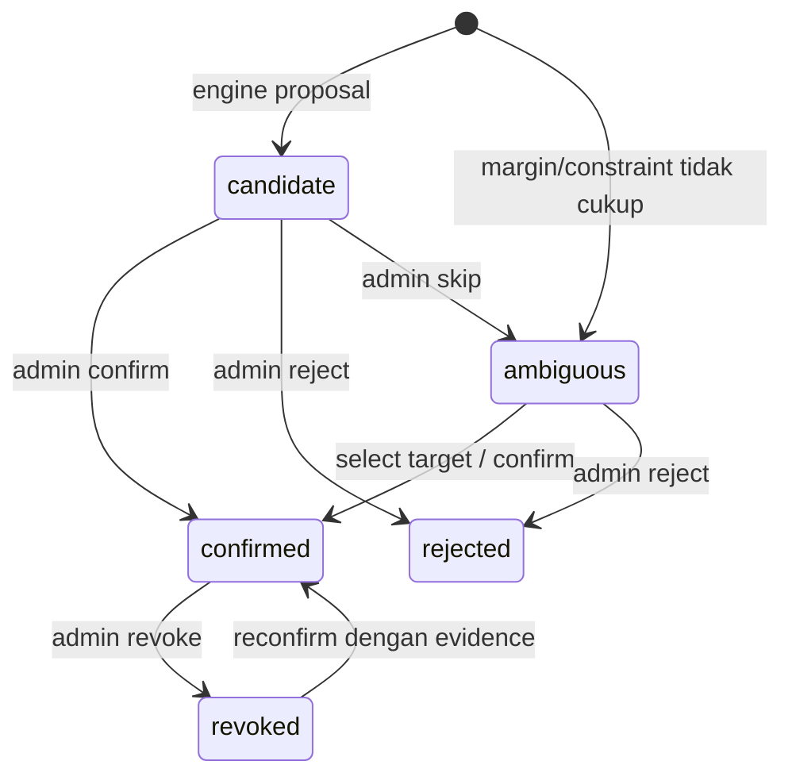

# Spesifikasi Implementasi Fungsional SINERGI — Fase 1 sampai Fase 5

Status: **disetujui sebagai arah implementasi**  
Versi dokumen: **1.0.0**  
Tanggal keputusan: **12 Agustus 2026**  
Cakupan: **kepercayaan dataset, peta operasional, topologi terverifikasi, tracing/analisis dampak, dan diagram topologi**  
Di luar cakupan: autentikasi enterprise, notifikasi, monitoring real-time, integrasi Zabbix/CMDB, dan penyempurnaan UI/UX

## 1. Fungsi dokumen

Dokumen ini adalah spesifikasi implementasi utama untuk Fase 1–5 SINERGI. Ia
bukan daftar ide, mockup UI, atau roadmap tingkat tinggi. Dokumen ini mengunci:

- tujuan dan hasil bisnis setiap fase;
- batas produk dan sumber kebenaran data;
- istilah domain dan controlled vocabulary;
- arsitektur komponen dan arah dependensi;
- model data canonical dan derived;
- state machine import, publikasi, candidate, relation, dan graph;
- kontrak API target;
- aturan validasi dan readiness yang deterministik;
- urutan implementasi dan dependency antartask;
- acceptance criteria, test strategy, dan exit gate setiap fase.

Jika implementasi saat ini berbeda dengan dokumen ini, perbedaan tersebut
dicatat sebagai migration gap. Implementasi lama tidak otomatis menjadi
keputusan produk. Perubahan terhadap keputusan normatif dalam dokumen ini harus
dibuat melalui perubahan dokumen yang eksplisit, bukan melalui asumsi saat
coding.

Kata berikut bersifat normatif:

- **WAJIB / MUST**: tidak boleh dilanggar;
- **DILARANG / MUST NOT**: perilaku tersebut tidak boleh ada;
- **SEHARUSNYA / SHOULD**: dilakukan kecuali ada alasan teknis yang dicatat;
- **BOLEH / MAY**: opsional dan tidak menjadi exit gate fase.

## 2. Keputusan produk yang dikunci

### 2.1 Posisi SINERGI

SINERGI **bukan pengganti Google Earth untuk authoring**. Pembagian tanggung
jawabnya adalah:

| Aktivitas | Sistem utama |
|---|---|
| Membuat atau mengoreksi Point/LineString/Polygon | Google Earth |
| Mengatur geometri dan struktur sumber KMZ | Google Earth |
| Mengimpor dan memvalidasi source package | SINERGI |
| Menentukan versi resmi yang dibaca pengguna | SINERGI |
| Mencari dan melihat detail aset | SINERGI |
| Memverifikasi kandidat koneksi | SINERGI |
| Tracing dan analisis dampak | SINERGI |
| Menampilkan diagram logis | SINERGI |

Source KML/KMZ tidak diedit oleh SINERGI pada Fase 1–5. Koreksi geometri yang
ditemukan saat review dikembalikan ke workflow Google Earth dan masuk kembali
melalui dataset version baru.

### 2.2 Hero workflow

Seluruh fase harus mendukung satu alur operasional berikut:

```text
Administrator mengimpor versi sumber resmi
-> sistem membuktikan kelengkapan dan kualitas data
-> administrator mempublikasikan versi yang tepat
-> pengguna memilih site/area
-> pengguna mencari aset
-> pengguna memahami posisi dan detail aset
-> pengguna melihat koneksi langsung yang terverifikasi
-> pengguna melakukan trace
-> pengguna melihat jalur serta aset yang mungkin terdampak
-> pengguna membuka diagram logis dari graph yang sama
```

Fitur yang tidak memperkuat alur ini tidak menjadi prioritas Fase 1–5.

### 2.3 Dua publication profile

Satu dataset version dipublikasikan dengan tepat satu profile:

1. `map_only`
   - data boleh dipakai untuk lokasi, pencarian, filter, dan detail yang tersedia;
   - membutuhkan `parse_readiness` dan `map_readiness` yang layak;
   - tidak boleh mengklaim inventaris lengkap atau topologi operasional;
   - tracing, impact analysis, dan diagram operational graph dinonaktifkan.

2. `operational_topology`
   - data boleh dipakai untuk seluruh kemampuan `map_only`;
   - membutuhkan parse, map, inventory, dan topology readiness;
   - tracing, impact analysis, dan diagram hanya membaca confirmed graph.

Publication profile tidak disimpulkan oleh frontend. Backend menyimpan dan
mengembalikannya sebagai bagian dari active dataset contract.

### 2.4 Keputusan keselamatan topologi

- LineString adalah geometri jalur, bukan otomatis edge graph.
- Kedekatan titik dengan garis adalah evidence, bukan fakta koneksi.
- Persilangan dua garis bukan junction kecuali ada evidence junction atau
  metadata eksplisit.
- Semua inferensi spasial berstatus `candidate` atau `ambiguous` secara default.
- Hanya relation dengan `verification_status=confirmed` yang masuk graph.
- Candidate, ambiguous, rejected, dan revoked tidak boleh dilalui tracing.
- Peta, tracing, impact analysis, dan diagram membaca graph revision yang sama.
- Menyembunyikan layer di client tidak boleh mengubah node/edge canonical.

### 2.5 Urutan fase yang dikunci

```text
Fase 1 — Dataset benar dan dapat dipercaya
    ↓ exit gate
Fase 2 — Peta operasional minimum
    ↓ exit gate
Fase 3 — Pembangunan dan verifikasi topologi
    ↓ exit gate
Fase 4 — Tracing dan analisis dampak
    ↓ exit gate
Fase 5 — Diagram topologi cabang
```

Pekerjaan fase berikutnya boleh disiapkan secara teknis, tetapi tidak boleh
diklaim selesai atau dipublikasikan sebelum exit gate fase dependensinya lulus.

## 3. Scope dan non-goal

### 3.1 In scope

- KML dan KMZ immutable sebagai source package;
- Folder, Placemark, ExtendedData/SchemaData, style, geometry, dan GroundOverlay;
- Point, LineString, Polygon, dan MultiGeometry;
- classification object role, network family, category, dan asset type;
- stable Asset ID dan identity resolution lintas versi;
- dataset version, diff, validation, activation, dan rollback;
- peta geographic read-only;
- search, filter, asset detail, provenance, dan export;
- candidate generation, review, relation confirmation/revocation;
- confirmed operational graph dan graph revision;
- trace connectivity, directional trace, dan impact analysis;
- logical topology projection dan export diagram.

### 3.2 Explicit non-goal

- editing geometri di web;
- monitoring status perangkat secara real-time;
- discovery perangkat dari jaringan;
- sinkronisasi Zabbix/CMDB;
- notifikasi gangguan;
- registrasi akun mandiri dan workflow akses enterprise;
- dashboard eksekutif;
- peta 3D;
- automatic repair terhadap source KML;
- AI/ML yang langsung membuat confirmed relation;
- optimasi UI visual di luar yang diperlukan untuk menguji fungsionalitas.

## 4. Persona dan kewenangan fungsional

Role lengkap enterprise ditunda, tetapi boundary fungsi tetap harus jelas.

### 4.1 Viewer operasional

Dapat:

- membaca satu active dataset per dataset/site;
- mencari, memfilter, dan membuka detail aset;
- melihat confirmed relation;
- melakukan trace dan impact analysis;
- membuka serta mengekspor diagram/peta yang diizinkan.

Tidak dapat:

- mengimpor, mengaktifkan, rollback, atau menolak dataset;
- mengonfirmasi/reject/revoke relation;
- melihat source issue sensitif jika endpoint dibatasi administrator.

### 4.2 Administrator data/topologi

Memiliki seluruh kemampuan viewer dan dapat:

- import, preview, compare, activate, reject, dan rollback dataset version;
- melihat seluruh issue dan evidence;
- regenerate candidate;
- confirm, select target, reject, skip, revoke, dan membuat manual relation;
- melihat audit history dan revision conflict.

### 4.3 Sistem/worker

- membaca source immutable;
- menjalankan parser, normalizer, classifier, diff, dan candidate engine;
- tidak memiliki kewenangan bisnis untuk mengonfirmasi inferred relation;
- tidak boleh mengubah active pointer selain melalui lifecycle service.

## 5. Prinsip dan invarian sistem

Semua implementasi Fase 1–5 wajib menjaga invarian berikut.

1. Satu entity canonical hanya dimiliki satu `dataset_version_id`.
2. Source bytes dan source geometry immutable setelah upload diterima.
3. Setiap feature dipertahankan atau dilaporkan sebagai issue; tidak boleh
   hilang diam-diam.
4. `source_feature_id`, `asset_id`, dan `geometry_id` adalah identitas berbeda.
5. Rename atau perpindahan folder tidak boleh otomatis menciptakan Asset ID
   bisnis baru jika identity mapping yang sudah disetujui tersedia.
6. Fallback identity tidak pernah memenuhi inventory readiness.
7. Classification dan topology rule mempunyai versi dan fingerprint.
8. Frontend tidak menjalankan parser semantic atau topology inference.
9. Active pointer berubah hanya melalui transaksi activation/rollback.
10. Import, parser failure, candidate regeneration failure, atau preview tidak
    boleh mengubah active pointer.
11. Operational graph hanya dibangun dari confirmed relation.
12. Setiap mutation review bersifat idempotent dan memakai optimistic
    concurrency revision.
13. Trace harus menyebut `datasetVersionId` dan `graphRevision` yang dipakai.
14. Diagram tidak menyimpan graph kedua; diagram hanya projection/layout.
15. Resource eksternal dari KML tidak di-fetch otomatis.
16. Kegagalan yang berpengaruh pada kepercayaan data harus fail closed.

## 6. Baseline codebase dan migration stance

Fondasi berikut sudah ada dan **dipertahankan**:

- upload validation dan safe KMZ extraction;
- parser KML server-side;
- immutable source storage dan checksum;
- dataset version repository JSON dan PostgreSQL adapter;
- atomic activation/rollback pointer;
- durable job abstraction;
- evidence-preserving parser contract;
- semantic constrained relation engine;
- candidate review API dan audit;
- graph revision dan trace API;
- MapLibre geographic map;
- ELK worker dan SVG topology renderer;
- PostgreSQL/PostGIS operational schema.

Gap yang harus ditutup oleh Fase 1–5:

| Gap | Dampak | Fase pemilik |
|---|---|---:|
| Stable identity sumber aktual belum lengkap | Diff dan graph lintas versi tidak dapat dipercaya | 1 |
| Readiness masih tersebar pada beberapa contract | Publication bisa salah klaim | 1 |
| Diff versi belum menjadi gate yang eksplisit | Aset hilang/perubahan besar mudah lolos | 1 |
| Search masih bergantung pada payload active dataset | Skala dan ranking belum terkunci | 2 |
| Metadata aset pilot belum lengkap | Detail aset kurang berguna | 1–2 |
| Confirmed coverage pada data aktif masih nol/rendah | Tracing dan diagram tidak memberi value | 3 |
| Trace runtime sekarang hanya physical `both` | Upstream/downstream belum bermakna | 4 |
| Impact analysis belum menjadi domain service | Tidak ada daftar aset terdampak yang dapat dijelaskan | 4 |
| Topology view belum mempunyai load/SLO gate | Halaman bisa gagal menjadi alat operasional | 5 |

Strategi implementasi adalah incremental migration. Rewrite besar tidak wajib.
Yang wajib adalah domain contract tunggal dan penghapusan perilaku yang
melanggar invarian.

## 7. Arsitektur target

### 7.1 Komponen logis



### 7.2 Source boundary

Struktur repository saat ini boleh tetap dipakai, dengan boundary minimal:

```text
backend/src/domain
  canonical contracts
  identity resolution
  controlled vocabulary
  readiness rules
  diff rules

backend/src/import
  upload lifecycle
  safe extraction
  parser/normalizer/classifier

backend/src/topology
  candidate generation
  review mutation
  graph builder/validator
  trace dan impact

backend/src/storage
  repository ports dan adapters

frontend/src
  API clients
  presentation state
  geographic/topology renderers
```

Backend DILARANG mengimpor source dari `frontend/src`. Domain tidak bergantung
pada HTTP, MapLibre, ELK, DOM, atau storage adapter konkret.

### 7.3 Write path

```text
upload
-> validate package
-> persist source immutable
-> create dataset version: processing/unpublished
-> enqueue parse_source
-> parse + normalize + classify
-> compute readiness dan version diff
-> generate topology candidate
-> persist immutable/derived artifacts
-> admin preview/review
-> publication gate
-> atomic active pointer switch
```

Candidate review setelah import dapat membentuk graph revision baru tanpa
mengubah source artifact. Mengubah parser/classifier/rule set harus membuat
derived artifact/revision baru dan menyimpan version fingerprint.

### 7.4 Read path

```text
viewer request + datasetId + branchId
-> resolve exactly one active pointer
-> authorize branch scope
-> read active dataset projection
-> return datasetVersionId + publicationProfile + readiness + revision
```

Client tidak boleh memilih version unpublished melalui endpoint viewer biasa.
Preview admin memakai endpoint terpisah.

### 7.5 Consistency dan concurrency

Revision yang wajib ada:

- `recordRevision`: concurrency seluruh dataset aggregate/repository;
- `candidateRevision`: fingerprint koleksi candidate dan statusnya;
- `graphRevision`: fingerprint confirmed node/edge graph;
- `activePointerRevision`: revision active dataset untuk dataset+branch.

Mutation candidate/relation wajib mengirim expected graph/candidate revision.
Activation wajib mengirim expected active version atau pointer revision. Jika
revision berbeda, server mengembalikan `409` dan tidak mengubah state.

## 8. Canonical domain model

### 8.1 Aturan ID

| ID | Scope | Stabilitas | Sumber |
|---|---|---|---|
| `dataset_id` | produk data lintas version | stabil | konfigurasi |
| `dataset_version_id` | satu import | immutable | server UUID |
| `source_feature_id` | feature dalam satu version | version-scoped | parser deterministic |
| `source_feature_key` | onboarding lintas version | tidak dijamin bisnis | fingerprint sumber |
| `asset_id` | aset bisnis lintas version | wajib stabil | metadata/registry terverifikasi |
| `geometry_id` | geometry dalam satu version | version-scoped | parser/normalizer |
| `candidate_id` | proposal per version/rule set | derived | deterministic fingerprint |
| `relation_id` | confirmed relation dalam version | derived/audited | relation service |
| `graph_revision` | snapshot confirmed graph | immutable | graph builder |

Semua ID yang dikirim di URL harus di-encode. ID tidak boleh mengandung control
character. `asset_id` maksimal 256 karakter pada contract berjalan; profile
pilot seharusnya memakai vocabulary yang lebih pendek dan manusiawi.

### 8.2 DatasetVersion

```json
{
  "id": "dv-...",
  "datasetId": "dataset-semarang",
  "branchId": "semarang",
  "versionName": "KMZ Area RJBT 2026-08-12",
  "versionNote": "Sumber resmi hasil validasi area pilot",
  "sourceFilename": "area-pilot.kmz",
  "sourceSize": 123456,
  "checksum": "sha256:...",
  "sourceStorageKey": "internal-only",
  "importedBy": "admin-1",
  "importedAt": "2026-08-12T00:00:00.000Z",
  "validationStatus": "pending|valid|invalid",
  "publicationStatus": "unpublished|published|archived",
  "status": "processing|valid|invalid|active|archived",
  "publicationProfile": "map_only|operational_topology|null",
  "recordRevision": 0
}
```

`sourceStorageKey` tidak boleh dikirim pada public API response.

### 8.3 SourceFeature dan SourceGeometry

SourceFeature mempertahankan fakta sumber:

```text
dataset_version_id
source_feature_id
source_feature_key
source_element_type
source_folder_path
source_name
source_kml_id?
source_style_url?
visibility
raw_properties
source_fingerprint
parser_version
```

SourceGeometry:

```text
dataset_version_id
geometry_id
source_feature_id
geometry_type
coordinates
source_coordinate_text
source_vertex_order_preserved = true
valid
bounds
geometry_fingerprint
```

Source coordinate wajib disimpan longitude-latitude sesuai KML. Normalizer
boleh menutup Polygon ring yang valid tetapi belum tertutup jika perubahan
tersebut dicatat sebagai information issue. Source bytes tetap tidak berubah.

### 8.4 ClassifiedObject / Asset

```text
classified_object_id
dataset_version_id
source_feature_id
asset_id?
identity_status
site_id
object_role
network_family
category
asset_type
asset_name
source_status
location_text?
hostname?
ip_address?
classification_status
classification_score
classification_evidence[]
classification_rule_set_version
geometry_ids[]
```

`identity_status`:

- `stable_explicit`: berasal dari metadata sumber resmi;
- `stable_registry`: berasal dari identity registry yang telah disetujui;
- `onboarding_candidate`: fallback yang belum menjadi identitas bisnis;
- `conflict`: lebih dari satu assignment atau duplicate;
- `not_applicable`: visual/coverage object yang bukan aset bisnis.

### 8.5 Controlled vocabulary awal

`object_role`:

```text
device_node
cable_path
coverage_area
ground_overlay
visual_only
unknown
```

`network_family`:

```text
cctv
fiber_optic
lan
infrastructure
unknown
```

`source_status`:

```text
active
planned
retired
unknown
```

`category` seed vocabulary:

```text
cctv
cctv_cable
junction_box
fiber_optic
lan
network_device
server
nvr
peripheral
supporting_infrastructure
coverage_area
visual_only
unknown
```

`asset_type` seed vocabulary:

```text
cctv_fixed
cctv_ptz
cctv_dome
junction_box
switch
router
server
nvr
rack
pole
fiber_cable
lan_cable
infrastructure_path
peripheral
unknown
```

Site pilot boleh menambah canonical value melalui vocabulary version baru,
tetapi tidak boleh mengirim arbitrary string lalu tetap menyatakan inventory
ready. Alias seperti `Outdoor PTZ Dome`, `PTZ Outdoor`, dan `CCTV PTZ` harus
dipetakan ke satu canonical value dan menyimpan mapping evidence.

Alias sumber boleh banyak, tetapi canonical value hanya satu. Mapping alias dan
rule classification wajib versioned.

### 8.6 GroundOverlay dan resource

```text
overlay_id
dataset_version_id
source_feature_id
name
visibility
draw_order
resource_id?
resource_resolution_status
lat_lon_box? {north,south,east,west,rotation}
lat_lon_quad? [[lon,lat], ... x4]
altitude?
altitude_mode?
required_for_map
```

Resource lokal KMZ disimpan dengan checksum dan safe internal path. Resource
eksternal berstatus `external_blocked`, tidak diambil otomatis, dan dapat
menjadikan map `not_ready` jika overlay ditandai required.

### 8.7 ConnectionCandidate

```text
candidate_id
dataset_version_id
source_endpoint_id
source_path_asset_id
target_asset_id?
target_endpoint_id?
target_path_asset_id?
candidate_type
site_id
network_family
distance_m?
score
score_margin
evidence[]
candidate_status
proposal_status
topology_rule_set_version
generated_at
review?
```

`candidate_status` canonical untuk Fase 3:

```text
candidate
ambiguous
confirmed
rejected
revoked
```

Operasi `skip` memindahkan candidate menjadi `ambiguous` dengan
`proposal_status=skipped_by_admin`; tidak dibuat status keenam yang samar.

### 8.8 ConfirmedRelation

```text
relation_id
dataset_version_id
source_asset_id
target_asset_id
relation_type
relation_kind
direction
path_asset_ids[]
source_geometry_ids[]
provenance
verification_status
candidate_id?
verified_by
verified_at
revoked_by?
revoked_at?
evidence[]
audit_event_id
```

`provenance`:

```text
explicit_kml_metadata
approved_mapping
spatial_inference_reviewed
manual_admin
```

`direction`:

```text
undirected
source_to_target
target_to_source
bidirectional
```

`verification_status` hanya `confirmed` atau `revoked`. Revoked relation tetap
dipertahankan untuk audit tetapi tidak masuk graph aktif.

### 8.9 GraphRevision

```text
dataset_version_id
graph_revision
parent_revision?
status
nodes[]
edges[]
components[]
degree_by_node
isolated_node_ids[]
validation
built_at
```

Graph node memakai canonical `asset_id`. Graph edge wajib menunjuk satu
confirmed relation dan menyimpan direction, network family, path asset, serta
source geometry references yang diperlukan tracing/peta.

## 9. State machines

### 9.1 Dataset processing dan publication



Aturan:

- `processing` tidak dapat diaktifkan;
- `invalid` tidak dapat diaktifkan tanpa import atau derived run baru yang
  menghasilkan version valid;
- hanya satu version berstatus active untuk pasangan dataset+branch;
- activation dan archiving version lama terjadi dalam satu transaksi;
- archive menyimpan `archiveReason=superseded|rejected|rollback`;
- rollback hanya boleh menunjuk version archived yang valid dengan
  `archiveReason=superseded|rollback`, bukan version yang ditolak;
- rollback tidak mencampur entity.

### 9.2 Candidate dan relation



Setiap transisi mutasi wajib menghasilkan audit event. Reject, select-target,
revoke, dan manual relation wajib mempunyai reason non-empty. Confirm juga
seharusnya mempunyai reason pada bulk operation.

### 9.3 Graph revision

```text
building -> validated -> active -> superseded
building -> failed
active -> rolled_back (bila graph revision rollback didukung)
```

Graph baru menjadi active untuk dataset version hanya setelah validation lulus.
Request trace dengan graph revision lama mengembalikan `409 topology_graph_stale`.

## 10. Fase 1 — Dataset benar dan dapat dipercaya

### 10.1 Tujuan

Fase 1 memastikan bahwa SINERGI dapat menjawab dengan bukti:

1. file apa yang diimpor;
2. apa saja yang berhasil dan gagal dibaca;
3. objek mana yang merupakan aset operasional;
4. identitas mana yang stabil lintas versi;
5. apa yang berubah dibanding version aktif;
6. kemampuan apa yang aman dipublikasikan;
7. bagaimana kembali ke version sebelumnya tanpa mencampur data.

Fase ini bukan sekadar “upload tidak error”. Hasil akhirnya adalah dataset
version yang dapat diaudit dan publication decision yang fail closed.

### 10.2 Deliverable

- source KML/KMZ immutable beserta checksum;
- canonical parser output yang lengkap;
- classified object dan identity status;
- issue/readiness report per dimensi;
- version comparison terhadap active version;
- preview read-only;
- activation dengan publication profile;
- rollback atomik;
- provenance dan version fingerprint.

### 10.3 F1-01 — Upload dan package safety

Backend WAJIB:

- menerima tepat satu file `.kml` atau `.kmz`;
- memvalidasi extension, MIME, signature, size, dan sanitized filename;
- menghitung SHA-256 saat streaming upload;
- menolak encrypted entry, zip slip, absolute path, drive path, archive bomb,
  DTD, dan external entity;
- membatasi entry count, extracted size, compression ratio, dan KML size;
- menyimpan source menggunakan internal storage key acak;
- tidak memakai filename pengguna sebagai filesystem path;
- mencatat upload accepted/rejected tanpa token atau credential;
- membuat `dataset_version_id` sebelum background processing;
- mengembalikan `202` dan durable job status URL.

Duplicate source checksum pada dataset+branch tidak otomatis ditolak. Sistem
menandainya sebagai `duplicate_source_checksum`; administrator boleh
membatalkan atau melanjutkan jika version metadata memang berbeda.

### 10.4 F1-02 — Evidence-preserving parser

Parser WAJIB membaca atau melaporkan:

- Document dan nested Folder;
- Placemark;
- ExtendedData Data/SimpleData dan SchemaData;
- Point, LineString, Polygon, MultiGeometry;
- Style, StyleMap, IconStyle, LineStyle, PolyStyle, LabelStyle;
- visibility dan altitudeMode;
- GroundOverlay dengan LatLonBox atau `gx:LatLonQuad`;
- local resources yang diizinkan;
- NetworkLink dan unsupported elements sebagai diagnostics.

Coverage report minimum:

```json
{
  "sourceElementCounts": {},
  "parsedElementCounts": {},
  "unsupportedElementCounts": {},
  "renderableGeometryCounts": {},
  "invalidGeometryCounts": {},
  "overlayCounts": {
    "total": 0,
    "resolved": 0,
    "missing": 0,
    "externalBlocked": 0
  }
}
```

Invariant coverage:

```text
source element = canonical artifact
              OR explicit issue dengan source path
```

Tidak boleh ada third state “diabaikan”.

### 10.5 F1-03 — Classification

Classifier memakai urutan evidence berikut:

1. metadata eksplisit;
2. approved identity/category mapping;
3. folder path;
4. nama Placemark;
5. resolved style;
6. parent context;
7. `unknown`.

Untuk setiap keputusan, simpan `rule_id`, observed value, normalized value,
weight, dan explanation. Classification yang tidak memenuhi threshold rule set
tetap `unknown`; sistem DILARANG memaksa seluruh Point menjadi device atau
seluruh LineString menjadi cable.

Classification menghasilkan:

- object role;
- network family;
- category;
- asset type;
- site assignment;
- score/status/evidence;
- classification rule set version.

### 10.6 F1-04 — Stable identity lintas versi

Identity resolution mengikuti urutan deterministik:

```text
explicit asset_id dari sumber resmi
-> approved identity registry mapping
-> exact immutable source KML ID yang sebelumnya sudah dipetakan
-> onboarding candidate untuk review
```

Nama, folder path, urutan Placemark, atau geometry fingerprint **tidak pernah
sendiri** menghasilkan stable Asset ID. Nilai tersebut hanya evidence untuk
usulan identity match.

Target tambahan pada persistence:

```text
asset_identity_registry
  registry_id
  dataset_id
  branch_id
  asset_id
  source_match_type
  source_match_value
  valid_from_dataset_version_id
  valid_to_dataset_version_id?
  status: active|superseded|rejected
  approved_by
  approved_at
  evidence
  audit_event_id
```

Aturan identity registry:

- satu active source match tidak boleh menunjuk dua Asset ID;
- satu Asset ID boleh memiliki beberapa historical source match;
- assignment baru tidak mengubah version yang sudah dipublikasikan;
- konflik menjadi blocking issue untuk inventory/topology publication;
- merge/split identity tidak dilakukan diam-diam dan memerlukan action serta
  audit event khusus;
- fallback onboarding tetap dapat dipetakan pada profile `map_only` tetapi
  ditandai bukan identitas bisnis.

### 10.7 F1-05 — Metadata minimum

Object yang `object_role=device_node|cable_path` dan `source_status!=retired`
dihitung sebagai operational asset. Untuk inventory readiness, setiap
operational asset WAJIB mempunyai:

- stable `asset_id`;
- `asset_name`;
- `asset_type` dari vocabulary;
- `category`;
- `site_id`;
- `source_status`.

`hostname`, `ip_address`, `location_text`, owner unit, dan notes bersifat
opsional pada Fase 1. Jika field tersebut tersedia, raw value dan normalized
value tetap disimpan bersama provenance.

### 10.8 F1-06 — Readiness contract tunggal

Semua API memakai satu bentuk readiness:

```json
{
  "schemaVersion": "2.0.0",
  "parse": {
    "status": "ready|ready_with_warnings|not_ready|not_applicable",
    "blockingIssueCount": 0,
    "warningCount": 0,
    "coverage": {},
    "reasons": []
  },
  "map": {},
  "inventory": {},
  "topology": {},
  "publishableProfiles": ["map_only"],
  "evaluatedAt": "ISO-8601",
  "policyVersion": "publication-policy:1"
}
```

Tidak boleh ada boolean lain yang bertentangan dengan contract ini. Boolean
compatibility seperti `mapReady` harus dihitung dari readiness contract dan
ditandai deprecated.

#### Parse readiness

`ready` jika:

- package aman;
- XML well-formed;
- root KML dipilih deterministik;
- seluruh source element didukung atau dilaporkan;
- tidak ada blocking parser issue.

`ready_with_warnings` jika semua syarat di atas terpenuhi tetapi terdapat
unsupported non-critical element atau normalisasi aman.

`not_ready` jika package/parser gagal, terdapat invalid critical structure,
atau coverage report tidak dapat direkonsiliasi.

#### Map readiness

`ready` jika:

- parse tidak `not_ready`;
- site dan geographic bounds valid;
- 100% geometry yang ditandai `required_for_map` renderable;
- 100% required GroundOverlay resolved dan positionable;
- tidak ada unsupported critical visual element.

`ready_with_warnings` jika seluruh required object tersedia tetapi ada
geometry/overlay non-critical yang tidak dapat dirender dan dilaporkan.

`not_ready` jika satu required map object hilang/invalid, site tidak diketahui,
atau bounds tidak valid.

#### Inventory readiness

`ready` jika:

- 100% operational asset memiliki stable Asset ID;
- 100% operational asset memenuhi metadata minimum;
- tidak ada duplicate/conflicting Asset ID;
- seluruh vocabulary value canonical;
- tidak ada object `unknown` yang secara profile pilot ditandai harus menjadi
  aset operasional.

`ready_with_warnings` hanya diperbolehkan untuk field opsional atau object
non-operasional. Missing stable ID atau metadata minimum selalu `not_ready`.

#### Topology readiness

Pada Fase 1 statusnya `not_applicable` sebelum candidate/graph dibangun, atau
`not_ready` bila graph dibutuhkan tetapi belum memenuhi Fase 3. Definisi
lengkap ada pada Fase 3.

### 10.9 F1-07 — Issue contract dan blocking profile

```json
{
  "id": "issue:...",
  "datasetVersionId": "dv-...",
  "severity": "error|warning|information",
  "issueCode": "missing_stable_asset_id",
  "scope": "file|structure|asset|geometry|overlay|classification|relation|version_integrity|processing",
  "readinessDimension": "parse|map|inventory|topology",
  "blockingProfiles": ["operational_topology"],
  "message": "...",
  "focus": {"assetId": "...", "sourceFeatureId": "..."},
  "details": {},
  "recommendedAction": "..."
}
```

Perubahan penting terhadap contract lama: `severity=error` tidak selalu
memblokir semua publication profile. Contoh `missing_stable_asset_id` memblokir
`operational_topology` tetapi tidak harus memblokir `map_only` jika map
readiness terpenuhi. Sebaliknya invalid coordinate pada required map feature
memblokir keduanya.

Issue code minimum yang wajib stabil:

```text
unsafe_package
invalid_kml_xml
unsupported_critical_element
unsupported_kml_element
invalid_coordinate
invalid_geometry
missing_required_overlay
external_overlay_blocked
unknown_site
unmapped_object
missing_stable_asset_id
duplicate_asset_id
identity_conflict
missing_required_metadata
invalid_vocabulary_value
dangling_explicit_relation
mixed_dataset_version_reference
duplicate_source_checksum
active_version_changed
processing_failed
```

### 10.10 F1-08 — Version comparison

Setelah canonicalization dan identity resolution, sistem membandingkan
candidate version terhadap active version pada dataset+branch yang sama.

Diff category:

```text
asset_added
asset_removed
asset_identity_changed
asset_metadata_changed
geometry_added
geometry_removed
geometry_changed
classification_changed
overlay_added
overlay_removed
overlay_changed
explicit_relation_added
explicit_relation_removed
explicit_relation_changed
```

Match utama memakai stable Asset ID. Feature tanpa stable ID ditampilkan sebagai
`unmatched_onboarding_object`; tidak boleh dipaksakan menjadi add/remove yang
seolah pasti.

Setiap diff record menyimpan before/after reference, changed fields, risk level,
dan explanation. Raw source bytes tidak perlu diduplikasi dalam diff.

Risk level:

- `low`: penambahan metadata opsional atau visual non-critical;
- `medium`: perubahan posisi/tipe/category yang masih valid;
- `high`: asset removed, identity changed, required overlay removed, relation
  removed, site changed, atau jumlah object turun di atas 10%.

Activation dengan minimal satu high-risk diff membutuhkan
`confirmBreakingChanges=true`. Konfirmasi hanya mengakui diff; ia tidak
mengabaikan blocking readiness issue.

### 10.11 F1-09 — Preview dan publication gate

Preview admin menampilkan projection candidate version tanpa menjadikannya
active. Semua preview response wajib memuat watermark/status
`publicationStatus=unpublished` secara data contract.

Publication evaluator menghitung:

```text
map_only publishable
  jika parse ∈ {ready, ready_with_warnings}
  dan map ∈ {ready, ready_with_warnings}

operational_topology publishable
  jika parse ∈ {ready, ready_with_warnings}
  dan map ∈ {ready, ready_with_warnings}
  dan inventory = ready
  dan topology = ready
```

Frontend tidak boleh mengaktifkan tombol dengan menghitung ulang aturan ini.
Frontend hanya memakai `publishableProfiles` dari backend.

### 10.12 F1-10 — Activation, rejection, dan rollback

Activation request target:

```json
POST /api/admin/imports/:datasetVersionId/activate
{
  "publicationProfile": "map_only|operational_topology",
  "confirmArchiveCurrent": true,
  "confirmBreakingChanges": false,
  "expectedActiveVersionId": "dv-old|null",
  "expectedRecordRevision": 12
}
```

Dalam satu transaksi:

1. lock active pointer dataset+branch;
2. verifikasi expected active version/revision;
3. evaluasi ulang publishability target profile;
4. archive version lama jika ada;
5. aktifkan candidate version dan simpan profile;
6. update pointer serta previous pointer;
7. tulis audit event;
8. commit;
9. invalidasi cache setelah commit.

Jika langkah 1–7 gagal, seluruh transaksi rollback.

Reject version membutuhkan reason dan hanya berlaku untuk version unpublished.
Rollback memakai target `previous_dataset_version_id` yang tercatat pada active
pointer, memverifikasi target masih valid, lalu menjalankan transaksi activation
yang sama. Rollback tidak menjalankan reparse dan tidak menggabungkan artifact.

### 10.13 API Fase 1

Endpoint yang dipertahankan/diperkuat:

| Method | Endpoint | Fungsi |
|---|---|---|
| GET | `/api/admin/import-config` | branch, dataset target, limits, workflow capabilities |
| POST | `/api/admin/imports` | upload dan create version |
| GET | `/api/admin/imports/:id` | processing, issues, readiness, can publish |
| GET | `/api/admin/imports/:id/preview` | preview projection unpublished |
| GET | `/api/admin/imports/:id/comparison` | diff terhadap active version |
| POST | `/api/admin/imports/:id/identity-assignments` | approve/reject identity mapping batch |
| POST | `/api/admin/imports/:id/activate` | atomic publication |
| POST | `/api/admin/imports/:id/reject` | reject unpublished version |
| POST | `/api/admin/datasets/:datasetId/branches/:branchId/rollback` | rollback pointer |
| GET | `/api/dataset-versions/:id/readiness` | canonical readiness contract |
| GET | `/api/dataset-versions/:id/source-features` | admin evidence projection |
| GET | `/api/dataset-versions/:id/geometries` | admin geometry projection |
| GET | `/api/dataset-versions/:id/overlays` | overlay projection |
| GET | `/api/dataset-versions/:id/classification-issues` | unknown/unmapped review |
| GET | `/api/dataset-versions/:id/source-file` | authorized original download |

Response mutasi WAJIB memuat `datasetVersionId`, revision terbaru, audit event ID,
dan state hasil. Error response memakai bentuk `{error:{code,message,details}}`.

### 10.14 Urutan implementasi Fase 1

1. Satukan readiness schema dan publication policy.
2. Tambahkan `publicationProfile` pada version/pointer contract dan migration.
3. Ubah issue menjadi profile-aware blocking.
4. Lengkapi coverage reconciliation parser dan required overlay policy.
5. Kunci controlled vocabulary serta mapping version fingerprint.
6. Tambahkan identity registry dan identity review operation.
7. Implement version diff service dan persistence/projection.
8. Perkuat preview contract.
9. Perluas activation transaction dengan profile dan high-risk confirmation.
10. Tambahkan rollback/integrity tests pada JSON dan PostgreSQL adapter.
11. Uji satu source pilot end-to-end dan simpan baseline snapshot.

### 10.15 Test Fase 1

Unit fixture minimum:

- safe KML dan safe KMZ;
- corrupt/encrypted/archive bomb/zip slip;
- DTD dan external entity;
- nested folder lima level;
- all supported geometry;
- invalid coordinates;
- duplicate KML ID dan duplicate Asset ID;
- ExtendedData/SchemaData;
- local/external/missing GroundOverlay;
- mapped, unmapped, visual-only, dan unknown object;
- fallback/onboarding/stable/conflicting identity;
- high-risk version diff.

Integration test minimum:

1. import sukses tidak mengubah active pointer;
2. import gagal tidak mengubah active pointer;
3. map-only dapat dipublikasikan walau inventory belum ready;
4. operational-topology ditolak jika stable ID belum 100%;
5. activation stale revision menghasilkan `409` tanpa partial update;
6. high-risk diff tanpa confirmation ditolak;
7. rollback mengembalikan version utuh;
8. source checksum dan source file integrity diverifikasi saat download;
9. JSON dan PostgreSQL repository menghasilkan lifecycle semantics yang sama;
10. parser rerun dengan input/rule version sama menghasilkan snapshot sama.

### 10.16 Exit gate Fase 1

Fase 1 selesai hanya jika:

- 100% source feature pilot dipertahankan atau dilaporkan;
- 100% required map geometry/overlay dapat direkonsiliasi;
- seluruh operational asset pilot mempunyai keputusan identity yang eksplisit;
- tidak ada duplicate/conflicting stable Asset ID pada profile topology;
- diff active-vs-candidate dapat dijelaskan per Asset ID;
- map-only dan operational-topology gate berbeda dan teruji;
- activation/rollback atomik lulus pada repository target deployment;
- source version lama tetap immutable dan dapat diunduh sesuai otorisasi;
- acceptance test Fase 1 lulus tanpa skipped test.

## 11. Fase 2 — Peta operasional minimum

### 11.1 Tujuan

Fase 2 membuktikan bahwa pengguna dapat menemukan dan memahami aset lebih cepat
daripada menyusuri folder KMZ di Google Earth. Fase ini tidak bergantung pada
topology readiness; dataset `map_only` harus tetap berguna dan jujur mengenai
keterbatasannya.

### 11.2 Deliverable

- resolver active dataset per branch/site;
- geographic map projection;
- search dan filter yang deterministik;
- asset detail dan provenance;
- direct relation summary jika tersedia;
- canonical shareable state;
- KML/KMZ export yang tidak mengubah source;
- functional performance baseline.

### 11.3 F2-01 — Active dataset resolution

Setiap viewer read diawali `datasetId` dan `branchId`. Server harus menemukan
tepat satu active pointer atau mengembalikan error eksplisit:

- `404 active_dataset_not_found` bila belum ada version aktif;
- `409 active_dataset_integrity_error` bila lebih dari satu active version atau
  pointer tidak konsisten;
- `403 forbidden_branch` bila user tidak mempunyai scope branch.

Active dataset response minimum:

```json
{
  "context": {
    "datasetId": "dataset-semarang",
    "datasetVersionId": "dv-...",
    "branchId": "semarang",
    "siteId": "booster-kutawinangun",
    "publicationProfile": "map_only",
    "activePointerRevision": "..."
  },
  "readiness": {},
  "summary": {},
  "capabilities": {
    "search": true,
    "assetDetail": true,
    "trace": false,
    "impact": false,
    "topologyDiagram": false,
    "reasonCodes": ["topology_not_ready"]
  }
}
```

Client memakai `capabilities`; client tidak menebak kemampuan dari jumlah edge.

### 11.4 F2-02 — Site/area scope

- Satu request peta wajib memiliki satu branch dan satu site/area aktif.
- Daftar site berasal dari classified canonical data/configuration, bukan
  hard-coded presentation demo.
- Extent site dihitung dari geometry valid dalam active version dan dapat
  dioverride oleh approved site boundary.
- Jika satu feature berada di luar extent, feature tetap ada tetapi dilaporkan
  sebagai `geometry_outside_site_extent`.
- Mengganti site menghapus selection/trace yang tidak termasuk site baru.

### 11.5 F2-03 — Geographic projection

Map response menggunakan GeoJSON-compatible longitude/latitude WGS84. Urutan
functional layer:

1. resolved required GroundOverlay;
2. coverage/area polygon;
3. cable/path LineString;
4. device Point;
5. confirmed trace/selection projection;
6. label projection.

Basemap tidak menjadi sumber data aset. Bila basemap gagal, canonical geometry
tetap dapat ditampilkan pada blank geographic surface dan response menyatakan
basemap unavailable. Sistem tidak boleh menggambar jalan/lokasi fiktif.

Map renderer mendukung Point, LineString, Polygon, MultiGeometry normalization,
LatLonBox overlay, dan `gx:LatLonQuad` jika source pilot menggunakannya.

### 11.6 F2-04 — Search

Search field:

- canonical/stable Asset ID;
- source/display name;
- asset type;
- category;
- location text;
- hostname;
- IP address jika user berwenang.

Normalisasi query:

- Unicode NFKC;
- trim whitespace;
- case-insensitive untuk text;
- punctuation Asset ID dipertahankan;
- minimum dua karakter untuk partial search;
- exact lookup Asset ID boleh satu karakter jika vocabulary mengizinkan.

Ranking deterministik:

| Match | Rank |
|---|---:|
| exact stable Asset ID | 100 |
| prefix stable Asset ID | 90 |
| exact asset name | 80 |
| prefix asset name | 70 |
| exact hostname/IP | 65 |
| exact type/category | 60 |
| token match location/name | 50 |
| generic substring | 40 |

Tie-break: rank descending, asset name ascending, Asset ID ascending. Search
result tidak boleh berisi object `visual_only` kecuali filter admin eksplisit.

### 11.7 F2-05 — Filter

Filter target:

- `siteId`;
- `networkFamily`;
- `category`;
- `assetType`;
- `sourceStatus`;
- `identityStatus`;
- `topologyStatus`: connected, isolated, pending-review, not-applicable;
- optional geographic bounds.

Filter adalah intersection/AND antardimensi dan OR untuk beberapa nilai dalam
satu dimensi. Filter presentation tidak mengubah canonical count; API response
menyediakan `totalMatched` dan facets berdasarkan query.

### 11.8 F2-06 — Asset detail

Asset detail minimum:

```text
assetId dan identityStatus
assetName
objectRole, category, assetType, networkFamily
site/branch
sourceStatus
locationText
hostname/IP bila tersedia dan diizinkan
geometry references dan geographic bounds/location
source folder/layer
datasetVersionId, versionName, publishedAt
metadata provenance
confirmed direct connections
candidate count hanya untuk Administrator
capabilities untuk trace/diagram
```

Nilai tidak tersedia ditulis `null` dengan `availabilityReason`; jangan mengisi
teks fallback seolah data aktual. Viewer tidak menerima raw unsafe HTML dari
description KML.

Direct connection hanya berasal dari confirmed graph. Untuk profile map-only,
response mengembalikan array kosong dan reason `topology_not_published`, bukan
menebak koneksi dari garis terdekat.

### 11.9 F2-07 — Shareable application state

State yang memiliki makna fungsional disimpan pada URL:

```text
datasetId
branchId
siteId
selectedAssetId?
networkFamily[]?
category[]?
assetType[]?
topologyStatus[]?
```

URL tidak menyimpan token, IP sensitif, raw metadata, geometry, candidate
evidence, atau trace result penuh. Saat link dibuka dan active version telah
berubah, asset di-resolve melalui stable Asset ID. Jika tidak ditemukan,
response menjelaskan `asset_not_present_in_active_version`.

### 11.10 F2-08 — Export

Fase 2 menyediakan:

1. original source download untuk user yang berwenang;
2. export projection aktif ke KML untuk site/filter yang dipilih.

Export projection:

- mencantumkan dataset version, timestamp, dan filter pada metadata document;
- memakai canonical geometry tanpa modifikasi;
- mempertahankan Asset ID pada ExtendedData;
- tidak mengubah atau menggantikan source original;
- tidak menyertakan candidate relation;
- memberi nama file tersanitasi;
- dijalankan server-side untuk dataset besar dan streaming response.

### 11.11 API Fase 2

| Method | Endpoint | Fungsi |
|---|---|---|
| GET | `/api/datasets/:datasetId/active?branchId=...` | active context, readiness, capability |
| GET | `/api/datasets/:datasetId/active?branchId=...&view=map&siteId=...` | map projection compatibility endpoint |
| GET | `/api/datasets/:datasetId/active/assets?...` | search/filter/pagination/facets |
| GET | `/api/datasets/:datasetId/active/assets/:assetId?branchId=...` | asset detail |
| GET | `/api/datasets/:datasetId/active/sites?branchId=...` | site list dan bounds |
| GET | `/api/datasets/:datasetId/active/overlays?branchId=...&siteId=...` | resolved overlay descriptors |
| POST | `/api/datasets/:datasetId/active/exports/kml` | filtered KML export job/stream |

Asset query parameters:

```text
branchId required
siteId required
q optional
networkFamily optional multi-value
category optional multi-value
assetType optional multi-value
sourceStatus optional multi-value
identityStatus optional multi-value
topologyStatus optional multi-value
bounds optional west,south,east,north
cursor optional opaque
limit default 50, max 200
```

Response selalu memuat `datasetVersionId` dan `activePointerRevision` agar
client dapat mendeteksi version switch.

### 11.12 Urutan implementasi Fase 2

1. Kunci active dataset context/capability contract.
2. Tambahkan site projection dan approved extent.
3. Pisahkan map projection dari full repository aggregate.
4. Implement asset search index/query dan ranking.
5. Implement filter/facet/pagination.
6. Lengkapi asset detail dan availability reason.
7. Pastikan overlay endpoint hanya menyajikan resource resolved/authorized.
8. Standardisasi URL state dan stable ID resolution.
9. Implement server-side filtered KML export.
10. Buat benchmark task Google Earth vs SINERGI pada dataset pilot.

### 11.13 Test Fase 2

- exact/prefix/partial ranking;
- Unicode dan case normalization;
- filter AND/OR semantics;
- pagination tanpa duplicate/missing result;
- active pointer berubah di tengah session;
- asset lama tidak ada pada version baru;
- branch/site authorization;
- Point/Line/Polygon/overlay map contract;
- basemap unavailable tidak menghilangkan canonical geometry;
- asset detail tidak pernah mengambil candidate sebagai connection;
- export mengandung stable Asset ID dan version metadata;
- source HTML/script tidak dirender sebagai HTML;
- layer visibility tidak mengubah graph count.

### 11.14 Performance gate Fase 2

Untuk fixture pilot sampai 2.000 source features pada environment referensi:

- active context API p95 ≤ 500 ms setelah warm-up;
- search API p95 ≤ 500 ms;
- asset detail API p95 ≤ 300 ms;
- initial canonical map projection p95 ≤ 2 detik, tidak termasuk tile basemap;
- tidak ada response asset list tanpa pagination di atas batas kontrak.

Environment, dataset checksum, dan hasil benchmark wajib dicatat agar angka
dapat direproduksi.

### 11.15 Exit gate Fase 2

Fase 2 selesai hanya jika:

- minimal 90% peserta pilot dapat menemukan target tanpa bantuan;
- median waktu menemukan aset minimal 30% lebih cepat dari baseline Google
  Earth pada skenario dan dataset yang sama;
- lokasi sample aset diverifikasi konsisten dengan source;
- detail aset selalu menyebut version dan provenance;
- filter/search tidak mengubah data canonical;
- map-only publication tetap jujur dan menonaktifkan topology capability;
- seluruh test dan performance gate Fase 2 lulus.

## 12. Fase 3 — Pembangunan dan verifikasi topologi

### 12.1 Tujuan

Fase 3 mengubah classified geometry menjadi proposal koneksi yang dapat
dijelaskan, lalu membentuk graph operasional hanya dari keputusan yang dapat
dipertanggungjawabkan. Tujuan fase ini bukan memaksimalkan jumlah edge, tetapi
memaksimalkan kepercayaan terhadap edge yang dipublikasikan.

### 12.2 Deliverable

- versioned topology input bundle;
- endpoint/anchor model deterministik;
- candidate generation dengan evidence;
- ambiguity dan unresolved report;
- review queue dan mutation workflow;
- confirmed relation registry per dataset version;
- validated graph revision;
- topology readiness dan coverage report;
- review carry-forward yang aman antarversion.

### 12.3 F3-01 — Topology eligibility

Topology engine hanya menerima `TopologyInputBundle`:

```text
dataset_version
site
classified_nodes[]
classified_paths[]
geometries[]
explicit_relations[]
semantic_rule_set_version
topology_rule_set_version
```

Record eligible:

- `object_role=device_node` dengan Point valid; atau
- `object_role=cable_path` dengan LineString valid;
- stable Asset ID;
- site diketahui;
- network family diketahui;
- source status bukan retired;
- seluruh record berasal dari dataset version sama.

Record yang gagal eligibility tidak dibuang. Ia menghasilkan
`topology_eligibility_issue` dengan alasan dan tidak ikut candidate discovery.

Engine mempartisi input berdasarkan:

```text
dataset_version_id + site_id + network_family
```

Candidate lintas partition DILARANG.

### 12.4 F3-02 — Endpoint dan anchor identity

Setiap LineString part memiliki dua endpoint deterministik:

```text
endpoint_id = fingerprint(dataset_version_id, geometry_id, part_index, start|end)
```

Inline attachment memakai anchor derived:

```text
anchor_id
path_asset_id
geometry_id
line_measure_0_to_1
coordinate
candidate_or_relation_reference
```

Anchor tidak memotong atau mengubah source LineString. Segment untuk graph/peta
adalah derived projection. Perubahan tolerance tidak boleh menghasilkan
perubahan pada source geometry.

### 12.5 F3-03 — Candidate discovery

Candidate type canonical:

| Type | Makna |
|---|---|
| `endpoint_device` | ujung path dekat device compatible |
| `inline_device` | device yang diizinkan berada pada interior path |
| `endpoint_endpoint` | dua ujung path compatible dengan digitization gap |
| `intersection_with_junction` | intersection dengan junction evidence |
| `explicit_metadata` | relasi dinyatakan sumber |
| `line_label_connection` | label/identity path menjadi evidence koneksi antardevice |
| `line_label_attachment` | label path menjadi evidence attachment endpoint |
| `manual_relation` | relation dibuat administrator dengan evidence |

`line_label_*` adalah compatibility type untuk engine saat ini. Dalam contract
baru ia tetap harus mempunyai endpoint/target yang jelas dan tidak boleh
langsung confirmed hanya karena nama garis mirip.

Discovery minimum:

- endpoint-to-device dalam configured search radius;
- inline-device-to-line hanya untuk allowed device type;
- endpoint-to-endpoint dengan distance dan continuation angle;
- line intersection hanya bila ada device junction atau rule eksplisit;
- explicit metadata dengan referential integrity check.

Default candidate search radius pilot adalah 6 meter. Nilai tersebut:

- boleh berbeda per site/network family;
- wajib berada dalam versioned topology rule set;
- hanya mengontrol recall candidate;
- tidak pernah menjadi automatic confirmation threshold.

Spatial index/PostGIS `ST_DWithin` digunakan pada persistence target. In-memory
adapter untuk test harus menghasilkan semantic result yang sama.

### 12.6 F3-04 — Hard gates dan scoring

Hard reject sebelum scoring:

- dataset version berbeda;
- site berbeda;
- network family incompatible;
- target `visual_only|unknown`;
- geometry invalid;
- melebihi maximum radius;
- forbidden candidate type untuk asset type;
- retired asset;
- explicit relation referensinya dangling;
- self target yang tidak diizinkan.

Score adalah nilai 0–1 dari rule set versioned:

```text
distance evidence
semantic compatibility
source/folder context
endpoint role
resolved style evidence
continuation angle
junction evidence
graph constraint evidence
```

Response candidate menyimpan komponen score secara terpisah. Reviewer harus
dapat menjelaskan mengapa score terbentuk tanpa membaca source code.

Proposal status:

- `recommended`: best candidate melewati minimum score dan margin;
- `ambiguous`: lebih dari satu kandidat layak tetapi margin tidak cukup;
- `below_threshold`: kandidat ditemukan tetapi bukti lemah;
- `capacity_conflict`: target terbaik melanggar degree/capacity constraint;
- `not_selected`: alternatif dari endpoint yang sama;
- `unresolved`: tidak ada target compatible.

Spatial auto-confirm tetap **OFF** pada Fase 3. Satu-satunya relation yang boleh
langsung confirmed adalah explicit metadata yang valid dan publication policy
secara eksplisit mengizinkannya. Policy tersebut tetap menyimpan provenance dan
validation result.

### 12.7 F3-05 — Constraint-aware proposal

Minimum constraint:

- satu cable endpoint maksimal satu target confirmed;
- explicit confirmed relation mengalahkan inferred proposal pada endpoint sama;
- dua ujung cable tidak boleh menuju node sama kecuali loop type disetujui;
- duplicate semantic relation tidak dibuat dua kali;
- accidental self-loop dilarang;
- intersection tanpa junction evidence tidak menyatukan component;
- device degree limit dapat dikonfigurasi per asset type;
- forbidden component merge menghasilkan blocking validation issue;
- visibility/filter UI tidak menjadi input.

Jika dua candidate sama-sama layak dan constraint tidak dapat memutuskan,
status wajib `ambiguous`, bukan memilih yang terdekat secara diam-diam.

### 12.8 F3-06 — Review queue

Default queue order deterministik:

1. ambiguous candidate pada topology-required asset;
2. candidate yang melibatkan root/core/distribution device;
3. recommended candidate score tertinggi;
4. unresolved required endpoint;
5. candidate lain;
6. candidate ID ascending sebagai tie-break.

Filter:

```text
status
site
networkFamily
candidateType
proposalStatus
minScore/maxScore
minDistance/maxDistance
source/target Asset ID search
requiredTopologyOnly
```

Pagination memakai opaque cursor yang terikat pada graph revision, candidate
revision, filter, dan sort. Cursor lama setelah mutation menghasilkan `409`
atau page restart eksplisit; tidak boleh mencampur snapshot.

### 12.9 F3-07 — Review actions

#### Confirm

Membutuhkan candidate ID, dataset version ID, expected graph/candidate revision,
idempotency key, dan optional reason. Server:

1. memverifikasi snapshot;
2. memverifikasi transisi;
3. mencatat audit event;
4. mengubah candidate menjadi confirmed;
5. membuat confirmed relation;
6. rebuild affected graph component;
7. validate graph;
8. publish graph revision baru hanya jika valid.

#### Select target

Membutuhkan reason. Target alternatif wajib berasal dari endpoint yang sama.
Candidate awal menjadi rejected dengan `target_replaced`; target terpilih
menjadi confirmed.

#### Reject

Membutuhkan reason. Rejected candidate tidak masuk graph dan dipertahankan
untuk regeneration carry-forward/audit.

#### Skip

Digunakan ketika reviewer belum dapat memutuskan. Candidate menjadi ambiguous
dengan proposal `skipped_by_admin`. Skip bukan reject dan tetap masuk antrian
ambiguity bila filter relevan.

#### Revoke

Membutuhkan reason. Relation menjadi revoked, candidate linked menjadi revoked,
affected component dibangun ulang, dan graph revision berubah.

#### Manual relation

Membutuhkan source/target stable Asset ID, relation type, direction, reason,
dan evidence reference. Manual relation tetap melewati referential integrity,
compatibility, constraint, dan graph validation yang sama.

### 12.10 F3-08 — Bulk operation policy

Unrestricted “confirm all” tidak boleh menjadi workflow produksi. Bulk confirm
hanya menerima explicit `candidateIds` dari satu candidate revision dan:

- maksimal 5.000 ID per request;
- seluruh candidate berstatus candidate;
- seluruh proposal `recommended`;
- tidak ada capacity/endpoint conflict;
- reason wajib;
- dry-run/preview summary wajib tersedia;
- mutation idempotent;
- seluruh batch atomik atau gagal seluruhnya.

Endpoint compatibility `confirm-all` harus diarahkan ke safe batch policy atau
dinonaktifkan pada production profile.

### 12.11 F3-09 — Confirmed graph builder

Operational graph memiliki:

- node: stable operational asset;
- edge: confirmed relation;
- path references: cable/path asset serta geometry yang menjadi evidence;
- component: connected component confirmed;
- revision: deterministic fingerprint dari sorted node/edge identity/status.

Graph builder tidak membaca candidate secara langsung selain candidate yang
sudah menghasilkan confirmed relation. Graph edge harus dapat dilacak ke audit
event dan source evidence.

### 12.12 F3-10 — Direction dan topology role

Direction tidak boleh disimpulkan dari urutan digitasi LineString. Direction
hanya berasal dari:

- explicit relation metadata;
- approved mapping rule yang terdokumentasi;
- keputusan administrator.

Untuk relation yang mewakili service flow, konvensinya dikunci sebagai berikut:

- `source_to_target`: source berada di sisi upstream dan aliran layanan menuju
  target/downstream;
- `target_to_source`: target berada di sisi upstream dan aliran layanan menuju
  source/downstream;
- `bidirectional`: service traversal diizinkan dua arah;
- `undirected`: hanya valid untuk physical connectivity dan tidak boleh dipakai
  upstream/downstream.

Relation lama yang belum mempunyai orientation tetap `undirected` sampai
diverifikasi; migration tidak boleh menebak orientation.

Untuk Fase 4, device boleh mempunyai topology role:

```text
root
core
distribution
endpoint
unknown
```

Role juga memerlukan metadata eksplisit atau review. Layout engine boleh memakai
role ini, tetapi tidak boleh menciptakannya sendiri.

### 12.13 F3-11 — Graph validation

Validation blocking:

- mixed dataset version;
- node tanpa stable Asset ID;
- edge bukan confirmed;
- edge menunjuk node yang tidak ada;
- cross-site edge;
- incompatible network family tanpa approved bridge type;
- duplicate edge;
- forbidden self-loop;
- invalid direction;
- relation tanpa provenance/audit;
- explicit dangling relation;
- forbidden component merge;
- candidate leak ke graph.

Validation warning:

- degree anomaly;
- isolated non-required node;
- unresolved non-required endpoint;
- component kecil yang mungkin incomplete;
- path length tidak tersedia;
- direction unknown pada edge yang tidak membutuhkan directional tracing.

### 12.14 F3-12 — Topology readiness

Site pilot mendefinisikan `topology_required=true` pada asset/path yang wajib
terhubung untuk skenario operasional. Readiness `ready` hanya jika:

- inventory readiness `ready`;
- graph validation error count = 0;
- 100% topology-required node memiliki minimal satu confirmed relation atau
  approved exception dengan reason;
- 100% topology-required path endpoint resolved atau approved exception;
- dangling explicit relation = 0;
- ambiguous/unresolved required item = 0;
- false component merge pada verified sample = 0;
- minimal 20 known paths end-to-end diverifikasi, atau seluruh known path jika
  totalnya kurang dari 20;
- seluruh known path sample lulus;
- topology rule set, graph revision, dan verification timestamp tersedia.

Non-required ambiguous/unresolved item boleh tersisa sebagai warning dan harus
tampil pada summary. Approved exception dihitung terpisah; exception tidak
boleh disamarkan sebagai koneksi.

### 12.15 F3-13 — Regeneration dan carry-forward

Regeneration mempertahankan keputusan review hanya jika semua berikut sama:

- stable source/target Asset ID;
- candidate semantic type;
- relevant geometry fingerprint;
- site dan network family;
- rule compatibility version;
- tidak ada identity/classification conflict baru.

Jika salah satu berubah, keputusan lama masuk history dan candidate baru harus
direview. Rejected decision juga dibawa agar false positive yang sama tidak
muncul sebagai fresh recommendation tanpa penjelasan.

Regeneration berjalan sebagai durable job, memiliki input fingerprint,
idempotency key, timeout, candidate count limit, progress, retry policy, dan
tidak mempublikasikan partial artifact.

### 12.16 API Fase 3

| Method | Endpoint | Fungsi |
|---|---|---|
| GET | `/api/dataset-versions/:id/topology/summary` | readiness, coverage, revisions |
| GET | `/api/dataset-versions/:id/topology/candidates` | filtered paginated review queue |
| GET | `/api/dataset-versions/:id/topology/graph` | confirmed graph projection |
| POST | `/api/dataset-versions/:id/topology/regenerate` | durable regeneration job |
| POST | `/api/dataset-versions/:id/topology/review-preview` | dry-run selected bulk mutation |
| POST | `/api/dataset-versions/:id/topology/confirm-selected` | safe atomic batch confirm |
| POST | `/api/dataset-versions/:id/topology/relations` | manual relation |
| POST | `/api/topology/candidates/:id/confirm` | confirm one |
| POST | `/api/topology/candidates/:id/reject` | reject one |
| POST | `/api/topology/candidates/:id/skip` | mark ambiguous/skipped |
| POST | `/api/topology/candidates/:id/select-target` | choose alternative |
| POST | `/api/topology/relations/:id/revoke` | revoke confirmed relation |
| GET | `/api/admin/jobs/:jobId` | regeneration state |

Setiap mutation menerima `Idempotency-Key` dan expected revisions. Replay dengan
key dan payload sama mengembalikan receipt sama. Key sama dengan payload berbeda
menghasilkan conflict.

### 12.17 Urutan implementasi Fase 3

1. Finalisasi topology-required profile, asset type compatibility, dan roles.
2. Kunci endpoint/anchor deterministic identity.
3. Audit candidate type dan hilangkan dependency visibility UI.
4. Pastikan seluruh spatial inference default candidate/ambiguous.
5. Implement evidence breakdown dan hard gate diagnostics.
6. Perkuat constraint/ambiguity handling.
7. Lengkapi query/filter/cursor review.
8. Terapkan safe review mutations dan dry-run bulk.
9. Perkuat affected-component graph rebuild dan validation.
10. Implement safe carry-forward antarversion.
11. Label dan verifikasi known-path set pilot.
12. Aktifkan topology publication profile hanya setelah readiness gate lulus.

### 12.18 Test Fase 3

- endpoint dengan satu target compatible;
- endpoint dengan dua target ambiguous;
- endpoint tanpa target;
- inline device yang allowed dan forbidden;
- endpoint-to-endpoint near miss;
- crossing tanpa junction;
- crossing dengan junction;
- visual-only point dekat cable;
- candidate beda site/family;
- duplicate/self-loop/capacity conflict;
- confirm/select/reject/skip/revoke/manual state transitions;
- idempotency replay dan payload conflict;
- stale graph/candidate revision;
- batch atomic failure;
- regeneration preserve/reopen review;
- hidden layer tidak mengubah candidate/graph;
- candidate/rejected/revoked tidak pernah masuk graph;
- known path dan component snapshot.

### 12.19 Exit gate Fase 3

Fase 3 selesai jika:

- tidak ada inferred edge confirmed tanpa explicit policy/review;
- 100% topology-required endpoints resolved atau approved exception;
- graph validation blocking error = 0;
- candidate leak ke graph = 0;
- seluruh known-path verification lulus;
- review/revoke dapat diaudit dan direplay secara idempotent;
- layer/filter UI tidak mengubah graph fingerprint;
- topology readiness untuk site pilot = `ready`;
- operational-topology publication berhasil melalui gate Fase 1.

## 13. Fase 4 — Tracing dan analisis dampak

### 13.1 Tujuan

Fase 4 memberikan alasan utama pengguna operasional membuka SINERGI: mengetahui
jalur terverifikasi dan memperkirakan aset yang terdampak tanpa menebak dari
garis pada peta.

### 13.2 Deliverable

- connectivity trace;
- point-to-point trace;
- upstream/downstream trace;
- reachable destination discovery;
- failure impact analysis berbasis root reachability;
- reasoned negative result;
- trace projection untuk peta dan diagram;
- trace audit dan reproducibility metadata.

### 13.3 F4-01 — Trace modes

```text
connectivity
point_to_point
upstream
downstream
reachable
```

- `connectivity`: physical confirmed graph diperlakukan dua arah;
- `point_to_point`: mencari path source ke target pada mode arah yang diminta;
- `upstream`: hanya mengikuti edge berlawanan arah service flow menuju root;
- `downstream`: hanya mengikuti edge searah service flow menjauhi root;
- `reachable`: mengembalikan node yang dapat dicapai dari source sesuai mode.

Upstream/downstream tidak tersedia bila direction/role belum cukup. Server
harus mengembalikan reason, bukan fallback diam-diam ke connectivity.

### 13.4 F4-02 — Trace request contract

```json
POST /api/dataset-versions/:id/topology/trace
{
  "sourceAssetId": "CAM-01",
  "targetAssetId": "CORE-01",
  "mode": "point_to_point",
  "direction": "upstream|downstream|both",
  "graphRevision": "topology-graph:...",
  "scopeAssetIds": null,
  "maxDepth": 100
}
```

Rules:

- source dan graph revision wajib;
- target wajib untuk `point_to_point`, opsional/tidak dipakai pada mode lain;
- `maxDepth` default 100, maximum 10.000;
- scope maksimum 10.000 Asset ID pada synchronous endpoint;
- source/target di-resolve ke canonical stable Asset ID;
- request terhadap version non-active hanya untuk preview/admin mode yang
  eksplisit;
- stale graph revision menghasilkan `409`.

Compatibility request lama `direction=both` dipetakan ke
`mode=point_to_point|reachable` sesuai keberadaan target.

### 13.5 F4-03 — Path algorithm

Untuk graph tanpa weight operasional, path default adalah shortest hop dengan
BFS. Traversal deterministik:

1. adjacency difilter confirmed edge;
2. direction filter diterapkan sesuai mode;
3. edge diurutkan `edge_id`, lalu target Asset ID;
4. visited set mencegah loop;
5. predecessor map merekonstruksi path;
6. jika beberapa path memiliki hop sama, urutan deterministik memilih hasil
   yang sama pada graph revision yang sama.

Jarak geometry tidak menjadi weight default karena jalur terpendek secara meter
belum tentu jalur layanan. Weighted routing hanya boleh ditambah bila metric
bisnisnya disetujui dan menjadi parameter eksplisit.

### 13.6 F4-04 — Direction semantics

Graph builder membuat adjacency terpisah:

- physical adjacency: semua confirmed edge dua arah untuk connectivity;
- service adjacency: mengikuti `source_to_target`, `target_to_source`, atau
  kedua arah untuk `bidirectional`;
- edge `undirected` tidak boleh dipakai untuk upstream/downstream.

Root/core designation wajib terverifikasi. Direction tidak boleh berasal dari
koordinat, urutan vertex, atau posisi node pada diagram.

### 13.7 F4-05 — Trace response

Response found:

```json
{
  "status": "found",
  "datasetVersionId": "dv-...",
  "graphRevision": "topology-graph:...",
  "mode": "point_to_point",
  "sourceAssetId": "CAM-01",
  "targetAssetId": "CORE-01",
  "componentId": "component:1",
  "nodeIds": ["CAM-01", "JB-01", "CORE-01"],
  "edges": [{
    "edgeId": "edge:...",
    "relationId": "relation:...",
    "sourceAssetId": "CAM-01",
    "targetAssetId": "JB-01",
    "pathAssetIds": ["LAN-01"],
    "sourceGeometryIds": ["geometry:..."],
    "relationType": "connected-via-path",
    "direction": "source_to_target",
    "provenance": "spatial_inference_reviewed",
    "verificationStatus": "confirmed"
  }],
  "hopCount": 2,
  "totalLengthMeters": 125.2,
  "verifiedAt": "ISO-8601",
  "explanation": "Jalur menggunakan confirmed operational graph."
}
```

`totalLengthMeters=null` jika satu atau lebih edge tidak memiliki length. Sistem
tidak boleh menjumlahkan partial length dan menyajikannya sebagai total lengkap.

### 13.8 F4-06 — Negative result taxonomy

Trace tanpa path tetap response sukses domain (`200`) dengan status/reason,
kecuali contract/stale/invalid graph yang menggunakan HTTP error.

Reason minimum:

```text
source_not_topology_node
target_not_topology_node
isolated_source
different_component
candidate_pending_review
direction_not_available
root_not_defined
scope_excludes_path
max_depth_reached
unreachable
```

Message harus menjelaskan tindakan berikutnya, misalnya periksa candidate atau
lengkapi direction. Server tidak boleh mengembalikan path candidate sebagai
“kemungkinan path” pada trace operational.

### 13.9 F4-07 — Impact analysis model

Impact analysis menjawab:

> Aset mana yang kehilangan reachability dari root layanan jika satu aset atau
> relation/path dinyatakan gagal pada confirmed graph revision ini?

Precondition:

- operational-topology profile aktif;
- graph valid;
- minimal satu verified root untuk site/network family;
- service direction tersedia pada bagian graph yang dianalisis.

Request:

```json
POST /api/dataset-versions/:id/topology/impact
{
  "failureType": "asset|relation|path",
  "failureId": "SWITCH-01",
  "graphRevision": "topology-graph:...",
  "rootAssetIds": null,
  "networkFamily": "cctv",
  "scopeAssetIds": null
}
```

Algorithm confirmed impact:

1. resolve verified root set;
2. hitung baseline node yang reachable dari root pada service adjacency;
3. buat simulation graph dengan failed node/edge/path references dihapus;
4. hitung reachable set setelah failure;
5. `confirmedImpacted = baselineReachable - afterFailureReachable`;
6. kelompokkan hasil berdasarkan site, category, dan component;
7. sertakan cut relation/path yang menyebabkan kehilangan reachability.

Edge `undirected` tidak dipaksa menjadi service direction. Node yang hanya dapat
dinilai melalui edge tersebut masuk `potentiallyImpacted` dengan reason
`direction_incomplete`; ia tidak digabung dengan confirmed impacted.

Impact analysis adalah simulasi topology, bukan pernyataan perangkat benar-benar
down. Response wajib memakai istilah `confirmedTopologyImpact` dan
`potentialTopologyImpact`, bukan status monitoring real-time.

### 13.10 F4-08 — Impact response

```json
{
  "status": "completed|partial|unavailable",
  "datasetVersionId": "dv-...",
  "graphRevision": "...",
  "failure": {},
  "roots": ["CORE-01"],
  "confirmedImpacted": [{
    "assetId": "CAM-01",
    "category": "cctv",
    "reason": "lost_root_reachability"
  }],
  "potentiallyImpacted": [],
  "cutEdges": [],
  "summary": {
    "baselineReachable": 30,
    "reachableAfterFailure": 20,
    "confirmedImpacted": 10,
    "potentiallyImpacted": 0
  },
  "limitations": [],
  "computedAt": "ISO-8601"
}
```

`partial` digunakan jika confirmed impact dapat dihitung tetapi direction pada
sebagian area incomplete. `unavailable` digunakan jika root tidak ada, graph
invalid/stale, atau failure ID bukan bagian graph.

### 13.11 F4-09 — Trace/impact projection

Result menyertakan node/edge/path/geometry IDs. Map dan diagram memakai ID ini
untuk highlight. Backend tidak mengirim screen coordinate atau ELK position.

Trace result boleh disimpan di client/URL sebagai opaque `traceRef` berumur
pendek. Jika server menyediakan persisted trace snapshot, key wajib terikat pada
user scope, dataset version, graph revision, request hash, dan expiration.

### 13.12 F4-10 — Audit dan cache

Setiap request mencatat:

- actor;
- dataset version/graph revision;
- source/target atau failure ID;
- mode;
- result status/reason;
- hop/impact count;
- correlation ID;
- duration.

Audit tidak menyimpan token atau seluruh geometry. Cache key:

```text
dataset_version_id + graph_revision + normalized_request_hash
```

Graph revision berubah berarti cache lama tidak dapat dipakai.

### 13.13 API Fase 4

| Method | Endpoint | Fungsi |
|---|---|---|
| POST | `/api/dataset-versions/:id/topology/trace` | semua trace mode |
| POST | `/api/dataset-versions/:id/topology/impact` | failure impact simulation |
| GET | `/api/dataset-versions/:id/topology/roots` | verified roots/roles/direction coverage |

Viewer endpoint hanya menerima dataset version yang active untuk branch user.
Admin preview dapat menambah query/header mode yang eksplisit dan tetap berlabel
unpublished.

### 13.14 Urutan implementasi Fase 4

1. Finalisasi relation direction dan verified topology roles.
2. Pisahkan physical dan service adjacency.
3. Generalisasi trace request dari `both` ke mode contract baru.
4. Implement deterministic directional BFS dan negative taxonomy.
5. Tambahkan direction/root coverage pada topology readiness.
6. Implement root reachability impact algorithm.
7. Implement partial/potential impact handling.
8. Tambahkan API, capability, audit, dan cache.
9. Hubungkan trace/impact IDs ke map projection.
10. Verifikasi known paths dan failure scenarios dengan teknisi.

### 13.15 Test Fase 4

- point-to-point path;
- source=target;
- isolated source;
- different component;
- candidate pending review;
- cycle dan visited-set safety;
- deterministic equal-hop path;
- upstream/downstream/bidirectional/undirected behavior;
- stale/invalid graph;
- scope/max-depth;
- node failure, edge failure, dan path failure impact;
- multiple roots;
- incomplete direction menghasilkan partial/potential result;
- candidate/rejected/revoked tidak pernah dilalui;
- cache invalidation saat graph revision berubah;
- audit failure tidak membuat trace unavailable.

### 13.16 Performance gate Fase 4

Pada synthetic graph 50.000 node dan 100.000 confirmed edge di environment
referensi:

- point-to-point trace p95 ≤ 1 detik;
- reachable traversal p95 ≤ 2 detik;
- impact simulation p95 ≤ 3 detik;
- memory peak dicatat dan tidak melewati guardrail deployment;
- request timeout menghasilkan error eksplisit tanpa partial path palsu.

### 13.17 Exit gate Fase 4

- 100% trace yang ditampilkan hanya memakai confirmed relation;
- seluruh known-path sample Fase 3 menghasilkan node/edge sequence yang benar;
- upstream/downstream hanya aktif pada graph dengan direction cukup;
- minimal lima skenario failure pilot diverifikasi teknisi;
- confirmed dan potential impact tidak tercampur;
- negative result selalu mempunyai reason yang actionable;
- performance dan integration test lulus.

## 14. Fase 5 — Diagram topologi cabang

### 14.1 Tujuan

Fase 5 menyediakan projection logis dari confirmed operational graph agar
struktur jaringan dapat dipahami tanpa mempertahankan jarak/orientasi geografis.
Diagram bukan sumber kebenaran baru dan bukan alat memperbaiki source geometry.

### 14.2 Deliverable

- active confirmed graph projection;
- logical layout contract;
- scope selected/neighbors/trace/component/site;
- verified hierarchy atau component fallback;
- selection synchronization dengan geographic map;
- export SVG dan PNG dengan revision metadata;
- deterministic cache dan worker failure handling;
- functional performance/load gate.

### 14.3 F5-01 — Sumber graph

Diagram selalu membaca:

```text
active dataset version
publication profile = operational_topology
active validated graph revision
confirmed node/edge collection
```

Diagram DILARANG:

- membangun edge dari proximity;
- membaca raw candidate sebagai operational edge;
- membuat copy relation yang dapat berbeda dari backend;
- menggunakan posisi diagram sebagai bukti arah/aliran;
- menampilkan unpublished graph kepada viewer biasa.

Jika publication profile bukan operational topology, endpoint capability
menyatakan `topologyDiagram=false` dan reason `topology_not_published`.

### 14.4 F5-02 — Diagram scopes

```text
selected
neighbors
trace
component
site
```

- `selected`: satu node terpilih;
- `neighbors`: node terpilih dan direct confirmed neighbors, default depth 1;
- `trace`: node/edge tepat dari trace result pada graph revision sama;
- `component`: seluruh connected component selected node;
- `site`: seluruh confirmed graph pada site aktif.

Scope request harus menyebut graph revision. Trace scope dengan trace revision
berbeda ditolak sebagai stale; sistem tidak mencoba mencocokkan edge lama.

### 14.5 F5-03 — Topology projection contract

Backend mengembalikan semantic projection, bukan screen layout:

```json
{
  "datasetVersionId": "dv-...",
  "graphRevision": "topology-graph:...",
  "scope": {"type": "component", "selectedAssetId": "CAM-01"},
  "nodes": [{
    "id": "CAM-01",
    "assetId": "CAM-01",
    "assetName": "Cam-01",
    "category": "cctv",
    "assetType": "cctv_fixed",
    "networkFamily": "cctv",
    "topologyRole": "endpoint",
    "componentId": "component:1",
    "groupKeys": {}
  }],
  "edges": [{
    "id": "edge:...",
    "relationId": "relation:...",
    "sourceNodeId": "CAM-01",
    "targetNodeId": "JB-01",
    "direction": "source_to_target",
    "relationType": "connected-via-path",
    "pathAssetIds": ["LAN-01"],
    "verificationStatus": "confirmed"
  }],
  "components": [],
  "summary": {},
  "validation": {}
}
```

Client worker menghasilkan `x`, `y`, width, height, bend points, dan group
bounds. Layout result tidak dipersistensikan sebagai domain data.

### 14.6 F5-04 — Hierarchy rules

Preferred layout memakai verified topology roles dan service direction:

```text
root -> core -> distribution -> endpoint
```

Rules:

- role/direction unknown tidak boleh ditebak dari nama atau degree di renderer;
- bila hierarchy lengkap, gunakan layered/hierarchical layout;
- bila direction incomplete, gunakan connected-component layout dan tandai
  `hierarchyStatus=incomplete`;
- disconnected component dipisahkan secara visual dan semantic;
- cycle tetap valid dan dirender; layout tidak boleh menghapus edge;
- component order deterministik berdasarkan root priority, node count
  descending, lalu component ID.

ELK.js adalah engine awal dengan layered algorithm dan orthogonal routing.
Engine boleh diganti selama input/output contract dan regression snapshot tetap
setara.

### 14.7 F5-05 — Grouping dan progressive scope

Grouping keys yang didukung:

```text
none
component
network_family
site_area
category
source_folder
```

Group/collapse adalah presentation state. Collapse tidak menghapus canonical
node/edge dan summary tetap menyebut hidden member count. Edge lintas group
menjadi aggregate connector hanya pada layout; membuka group mengembalikan edge
canonical yang sama.

Search/focus diagram memakai stable Asset ID dan asset name. Memilih hasil harus
menghasilkan selection identity yang dapat dibawa kembali ke Peta Aset.

### 14.8 F5-06 — Trace dan impact projection

Trace scope menerima node/edge IDs dari Fase 4 dan wajib memastikan:

- dataset version sama;
- graph revision sama;
- setiap node/edge masih tersedia;
- edge semuanya confirmed;
- urutan path dipertahankan sebagai metadata walau layout tidak geografis.

Impact scope menampilkan failed element, confirmed impacted, potentially
impacted, roots, dan cut edges sebagai semantic states. Diagram tidak menghitung
impact sendiri.

### 14.9 F5-07 — Candidate review projection

Candidate boleh ditampilkan hanya pada administrator review mode:

- dashed/non-operational connector;
- selalu memiliki candidate status dan evidence reference;
- tidak masuk confirmed edge count;
- tidak ikut trace/impact;
- hilang atau berubah setelah mutation response dan graph reload.

Operational topology diagram viewer tidak memuat candidate collection.

### 14.10 F5-08 — Synchronization dengan peta

Selection contract lintas projection:

```text
datasetId
branchId
siteId
datasetVersionId (read-only resolved)
selectedAssetId
graphRevision?
traceRef?
```

Diagram -> Peta:

- membawa selected stable Asset ID;
- geographic map fokus pada canonical geometry aset;
- jika aset tidak memiliki Point tetapi mempunyai path geometry, fit ke bounds.

Peta -> Diagram:

- membawa selected Asset ID;
- server menentukan component/scope pada graph revision aktif;
- aset non-topology menghasilkan reason `asset_not_topology_node`.

### 14.11 F5-09 — Layout cache dan invalidation

Cache key:

```text
dataset_version_id
+ graph_revision
+ scope_type/scope_identity
+ grouping_mode
+ layout_engine_version
+ layout_options_version
```

Filter dimming, label mode, dan current selection tidak membentuk cache baru
karena tidak mengubah topology layout. Candidate revision hanya masuk cache key
pada admin review projection.

Cache graph lama boleh dipertahankan untuk audit/admin preview tetapi tidak
boleh disajikan sebagai active viewer graph.

### 14.12 F5-10 — Worker dan failure semantics

Layout dijalankan di Web Worker agar main thread tidak diblokir. Functional
state minimum:

```text
loading_graph
graph_unavailable
layout_queued
layout_running
layout_ready
layout_timeout
layout_failed
stale_graph
empty_graph
```

Timeout/failure harus menghentikan loading indicator dan menyediakan retry
serta fallback accessible node/neighbor list. Halaman tidak boleh berada pada
state “memuat” tanpa batas.

Default layout timeout pilot: 10 detik. Setelah timeout, worker dihentikan dan
response/state mencatat graph size, engine version, serta correlation ID tanpa
menampilkan data sensitif.

### 14.13 F5-11 — Export

Export format Fase 5:

- SVG dengan vector node/edge dan embedded metadata;
- PNG hasil render SVG pada resolusi yang dipilih.

Metadata minimum:

```text
dataset/branch/site
dataset version dan version name
graph revision
scope/grouping
generated at
publication profile
legend status confirmed-only
```

Export operational tidak menyertakan candidate. Admin review export jika
ditambahkan harus diberi watermark `UNPUBLISHED REVIEW` dan status candidate.

### 14.14 API Fase 5

| Method | Endpoint | Fungsi |
|---|---|---|
| GET | `/api/datasets/:datasetId/active/topology?branchId=...&siteId=...&scope=...` | active confirmed topology projection |
| GET | `/api/dataset-versions/:id/topology/graph` | version graph compatibility/admin projection |
| POST | `/api/datasets/:datasetId/active/topology/exports` | optional server export job untuk graph besar |

Untuk client-side SVG/PNG export pada graph pilot, server export endpoint boleh
ditunda asalkan metadata/revision contract tetap dipenuhi.

### 14.15 Urutan implementasi Fase 5

1. Kunci active topology projection dan capabilities.
2. Implement scope resolver backend.
3. Standardisasi topology node/edge contract.
4. Pastikan ELK worker tidak membaca candidate/geometry inference.
5. Implement verified hierarchy dan component fallback.
6. Implement deterministic cache key/invalidation.
7. Hubungkan trace/impact projection.
8. Sinkronkan stable Asset ID dengan map URL state.
9. Implement worker timeout/error/accessible fallback.
10. Implement SVG/PNG export metadata.
11. Jalankan graph consistency dan performance tests.

### 14.16 Test Fase 5

- selected/neighbors/trace/component/site scope;
- topology capability pada map-only vs operational profile;
- candidate tidak muncul pada viewer graph;
- node/edge count sama dengan graph API;
- direction/hierarchy complete dan incomplete fallback;
- disconnected components dan cycle;
- group collapse tidak mengubah canonical count;
- selection round-trip map -> diagram -> map;
- stale trace/graph revision;
- layout cache invalidation;
- worker timeout/failure/retry;
- SVG/PNG metadata dan confirmed-only assertion;
- deterministic layout snapshot pada engine/options version sama.

### 14.17 Performance gate Fase 5

Pada environment referensi:

- graph 2.000 node / 4.000 edge: layout siap ≤ 5 detik;
- graph 10.000 node / 20.000 edge: layout atau progressive component view siap
  ≤ 10 detik;
- main thread tetap responsif selama worker berjalan;
- timeout selalu berakhir pada explicit failure/fallback state;
- graph API dan layout memory peak dicatat.

### 14.18 Exit gate Fase 5

- diagram dan trace memakai dataset version/graph revision yang sama;
- node/edge viewer semuanya confirmed;
- seluruh scope menghasilkan graph subset yang benar;
- selection map/diagram konsisten melalui stable Asset ID;
- disconnected/incomplete hierarchy tidak disamarkan;
- halaman tidak dapat loading tanpa batas;
- export menyebut version/revision/profile;
- functional, consistency, dan performance gate lulus.

## 15. Konfigurasi pilot yang wajib tersedia

Implementasi tidak boleh menyebarkan keputusan site pilot sebagai hard-code di
parser, topology service, dan frontend. Satu profile versioned menjadi input:

```json
{
  "profileVersion": "pilot-semarang:1",
  "datasetId": "dataset-semarang",
  "branchId": "semarang",
  "sites": [{
    "siteId": "booster-kutawinangun",
    "displayName": "Booster Kutawinangun",
    "approvedBounds": null,
    "requiredOverlayRules": [],
    "requiredObjectRules": [],
    "topologyRequiredRules": [],
    "rootAssetIds": [],
    "candidateRadiusMetersByNetworkFamily": {
      "cctv": 6,
      "fiber_optic": 6,
      "lan": 6,
      "infrastructure": 6
    }
  }],
  "metadataAliasesVersion": "metadata-alias:1",
  "classificationRuleSetVersion": "classification:1",
  "topologyRuleSetVersion": "topology:1",
  "publicationPolicyVersion": "publication-policy:1"
}
```

Sebelum site dapat operational-topology ready, field berikut tidak boleh kosong:

- topology required rules;
- root Asset IDs untuk directional/impact functionality;
- compatible asset/relation rules;
- known path verification set;
- approved exception list bila ada.

Perubahan profile version memicu dependency recomputation sesuai matrix pada
bagian 17.

## 16. Standar API lintas fase

### 16.1 Authentication dan authorization boundary

- semua endpoint `/api` selain health/basemap public policy memerlukan auth;
- admin projection/mutation memerlukan Administrator;
- server menentukan actor dari token, bukan request body;
- branch/dataset authorization dilakukan sebelum membaca detail entity;
- source file dan overlay resource menggunakan private cache policy;
- secret dan Authorization header tidak masuk audit.

### 16.2 Correlation dan error

Setiap response menyertakan `x-correlation-id`. Error body:

```json
{
  "error": {
    "code": "stable_machine_code",
    "message": "Pesan aman untuk pengguna",
    "details": {}
  }
}
```

HTTP semantics:

- `400`: request/domain field invalid;
- `401`: authentication required/invalid;
- `403`: role/scope forbidden;
- `404`: entity atau active resource tidak ditemukan;
- `409`: stale revision, invalid transition, integrity conflict;
- `413`: request/response limit;
- `415`: content type tidak didukung;
- `422`: source valid secara sintaks tetapi gagal business validation bila
  endpoint synchronous membutuhkannya;
- `500`: unexpected internal error dengan message aman;
- `503`: required service unavailable;
- `504`: generation/layout service timeout bila server-side.

### 16.3 Pagination

- cursor opaque, bukan offset mentah;
- cursor terikat pada filter/sort/revision;
- default dan maximum limit terdokumentasi per endpoint;
- response memuat `items`, `nextCursor`, `pageInfo`, dan revision;
- perubahan snapshot tidak boleh menghasilkan halaman campuran.

### 16.4 Idempotency

Semua mutation yang mungkin diretry memakai `Idempotency-Key`. Receipt
menyimpan normalized payload fingerprint, actor, action, resource, response,
dan timestamp. Idempotency tidak menggantikan optimistic concurrency revision.

## 17. Dependency dan recomputation matrix

| Perubahan | Recompute | Tidak berubah |
|---|---|---|
| Source KML/KMZ | parse, normalize, classify, diff, candidate, graph review state sesuai carry-forward | version lama |
| Parser version | normalize, classify, readiness, candidate | source bytes |
| Normalizer version | classify, readiness, diff, candidate | source bytes |
| Metadata alias/classification rule | classify, inventory readiness, candidate | source geometry |
| Identity assignment | diff, inventory readiness, candidate/graph affected | source feature/geometry |
| Required overlay policy | map readiness/publication | source overlay |
| Topology tolerance/scoring | candidate dan topology readiness | parser output |
| Candidate review | confirmed relation, affected graph component, readiness | source/classification |
| Relation revoke | affected graph component, trace/impact cache | source/candidate history |
| Map style/filter | presentation only | readiness/candidate/graph |
| ELK/layout options | layout cache only | graph/trace/impact |

Setiap recomputation membuat artifact revision baru atau record mutation yang
dapat diaudit. Hasil version lama tidak ditulis ulang diam-diam.

## 18. Persistence target dan migration

Schema PostgreSQL/PostGIS sekarang sudah menyediakan:

- `dataset_versions`;
- `source_features`;
- `source_geometries`;
- `classified_objects`;
- `topology_candidates`;
- `confirmed_relations`;
- `graph_revisions`, `graph_nodes`, `graph_edges`;
- `topology_jobs`;
- `accuracy_evaluations`;
- `audit_events`;
- `dataset_active_pointers`.

Penambahan target Fase 1–5:

```text
asset_identity_registry
dataset_version_diffs (atau indexed JSONB projection dengan contract setara)
dataset_publication_profile pada version/pointer
topology_roles/root assignments jika tidak disimpan pada classified payload
approved_topology_exceptions
known_path_verifications
```

Migration rule:

- semua migration memiliki up/down atau documented irreversible rationale;
- constraint diberlakukan di database untuk invariant kritis;
- backfill tidak mengaktifkan version;
- JSON repository tetap dapat dipakai untuk test/local baseline tetapi harus
  lulus repository parity suite;
- deployment pilot memakai PostgreSQL/PostGIS sebagai primary persistence;
- source bytes tetap di immutable file/object storage, bukan database blob.

## 19. Durable job contract

Job type relevan:

```text
parse_source
classify_objects
generate_candidates
rebuild_graph_component
regenerate_full_topology
evaluate_accuracy
publish_dataset
export_kml (tambahan bila asynchronous)
```

Setiap job menyimpan:

- job/dataset version ID;
- input fingerprint dan rule set version;
- idempotency key;
- queued/running/retry/dead-letter/completed state;
- attempt/max attempt;
- lease/lock;
- progress stage dan percentage;
- sanitized error code/summary;
- result reference.

Worker restart tidak boleh kehilangan accepted job. Job yang gagal tidak boleh
meninggalkan partial artifact sebagai active. Retry harus deterministic dan
idempotent.

## 20. Test architecture

### 20.1 Fixture tunggal end-to-end

Buat anonymized fixture yang memuat:

- nested Folder lima level;
- stable dan missing Asset ID;
- duplicate name dan duplicate ID;
- Point, LineString, Polygon, MultiGeometry;
- local, external, dan missing GroundOverlay;
- mapped/unmapped/visual/unknown classification;
- exact/ambiguous/unresolved endpoints;
- crossing tanpa/dengan junction;
- explicit, candidate, confirmed, rejected, revoked relation;
- directional root/core/distribution/endpoint path;
- disconnected component dan cycle;
- version kedua untuk identity/diff/carry-forward.

Fixture yang sama digunakan parser, repository, API, map adapter, topology,
trace, impact, dan browser E2E. Ini mencegah tiap layer memakai data demo yang
berbeda dan lolos secara terpisah.

### 20.2 Test layers

1. unit: pure domain rule dan deterministic function;
2. contract: runtime schema input/output;
3. repository parity: JSON vs PostgreSQL semantics;
4. integration: parser-to-publication dan review-to-graph;
5. API: auth, HTTP, revision, idempotency, error code;
6. browser E2E: hero workflow tanpa internal shortcut;
7. regression snapshot: counts/fingerprints/layout;
8. performance/stress: dataset dan graph sizes yang ditetapkan.

### 20.3 Snapshot metrics

```text
source_feature_count
geometry_count/type
overlay total/resolved/missing
classification coverage
stable identity coverage
diff counts/risk
candidate/recommended/ambiguous/unresolved counts
confirmed/rejected/revoked counts
graph node/edge/component/isolated counts
topology-required coverage
known path accuracy
trace/impact latency
layout latency/memory
```

Snapshot berubah hanya melalui reviewed expectation update dengan explanation.

## 21. Acceptance scenarios end-to-end

### Skenario A — Map-only publication

1. Admin upload KMZ tanpa stable Asset ID lengkap.
2. Parser dan map readiness lulus; inventory tidak ready.
3. Preview menunjukkan seluruh feature/overlay dan issue identity.
4. `map_only` publishable, `operational_topology` tidak.
5. Admin activate map-only.
6. Viewer dapat mencari dan membuka detail.
7. Trace/impact/diagram capability false dengan reason yang benar.

### Skenario B — Candidate version berisiko

1. Admin upload version baru yang menghapus aset penting.
2. Diff menandai `asset_removed` high risk.
3. Activation tanpa breaking confirmation ditolak.
4. Active pointer/version lama tidak berubah.
5. Setelah review dan konfirmasi eksplisit, activation atomik berhasil.

### Skenario C — Review koneksi

1. Engine menghasilkan dua target untuk endpoint sama.
2. Candidate ambiguous dan tidak masuk graph.
3. Admin memilih target dengan reason.
4. Mutation mencatat audit dan graph revision berubah.
5. Candidate alternatif rejected.
6. Viewer graph hanya memuat selected confirmed relation.

### Skenario D — Trace gangguan

1. Viewer mencari CAM-01.
2. Asset detail memuat direct confirmed relation.
3. Viewer trace upstream ke CORE-01.
4. Response memuat node/edge/path geometry dari graph revision aktif.
5. Candidate dekat jalur tidak ikut trace.
6. Peta dan diagram highlight ID yang sama.

### Skenario E — Impact failure

1. Viewer memilih SWITCH-01 sebagai failed asset simulation.
2. Server membandingkan root reachability sebelum/sesudah failure.
3. Confirmed dan potential impact dipisahkan.
4. Result menyebut limitation direction yang belum lengkap.
5. Tidak ada klaim status real-time.

### Skenario F — Rollback

1. Version baru aktif dan kemudian ditemukan masalah.
2. Admin rollback dengan expected active version.
3. Pointer kembali ke previous valid version dalam satu transaksi.
4. Peta, search, graph, trace, dan diagram seluruhnya membaca version lama.
5. Tidak ada entity dari dua version tercampur.

## 22. Work breakdown dan urutan eksekusi

Urutan ini menjadi default implementation backlog. Item berikutnya tidak
dimulai sebagai production behavior sebelum dependency sebelumnya lulus.

### Milestone 1A — Contract dan publication foundation

- readiness v2 schema;
- profile-aware issue blocking;
- publication profile persistence;
- active capability contract;
- migration dan repository parity.

### Milestone 1B — Parser, identity, dan diff

- coverage reconciliation;
- required overlay policy;
- controlled vocabulary/rule fingerprints;
- identity registry/review;
- stable identity coverage;
- version diff/risk gate.

### Milestone 1C — Lifecycle completion

- preview contract;
- profile-aware activation;
- high-risk confirmation;
- rollback integrity;
- pilot source baseline.

### Milestone 2A — Operational query

- active context/site projection;
- server search index/ranking;
- filter/facet/cursor;
- asset detail/provenance.

### Milestone 2B — Map contract dan export

- map projection/overlay resource;
- URL state;
- version switch handling;
- filtered KML export;
- Google Earth comparison study.

### Milestone 3A — Candidate correctness

- topology-required profile;
- endpoint/anchor identity;
- hard gates/scoring/evidence;
- ambiguity/constraint;
- candidate query.

### Milestone 3B — Review dan graph

- review mutations/idempotency/revision;
- safe batch preview/confirm;
- graph component rebuild;
- graph validation;
- regeneration/carry-forward.

### Milestone 3C — Verification gate

- known path set;
- root/direction assignment;
- topology coverage/readiness;
- operational-topology activation.

### Milestone 4A — Trace

- physical/service adjacency;
- trace modes;
- negative taxonomy;
- API/audit/cache;
- map projection.

### Milestone 4B — Impact

- root reachability;
- failure simulation;
- confirmed/potential split;
- scenario verification;
- performance gate.

### Milestone 5A — Topology projection

- active graph/scope resolver;
- hierarchy/component fallback;
- ELK worker/cache;
- trace/impact projection;
- map selection sync.

### Milestone 5B — Reliability dan export

- timeout/failure fallback;
- SVG/PNG metadata;
- graph/layout consistency;
- performance gate;
- full hero workflow E2E.

## 23. Definition of Ready untuk implementation task

Satu task baru boleh dikerjakan jika:

- phase/requirement ID diketahui;
- input/output contract tertulis;
- dependency dan owner component diketahui;
- persistence impact diketahui;
- error dan negative state diketahui;
- acceptance test minimal ditulis;
- fixture tersedia atau dibuat sebagai bagian task;
- security/data sensitivity impact dinilai;
- tidak ada keputusan produk terbuka yang disembunyikan sebagai TODO coding.

## 24. Definition of Done

Satu requirement dianggap selesai jika:

- implementasi memenuhi MUST/MUST NOT terkait;
- runtime validation dan error code tersedia;
- unit/contract/integration test lulus;
- repository parity test lulus jika menyentuh persistence;
- audit/idempotency/revision test lulus jika mutation;
- active version integrity tetap terjaga;
- dokumentasi API/contract diperbarui;
- regression snapshot direview;
- performance gate dijalankan jika jalur data besar;
- tidak ada feature flag development yang membuat behavior produksi ambigu;
- demo menggunakan fixture/source pilot melalui API sebenarnya.

Fase dianggap selesai hanya jika exit gate fase lulus; banyaknya file atau test
yang dibuat bukan pengganti exit gate.

## 25. Keputusan yang tidak boleh dibuka kembali tanpa change request

1. Google Earth tetap authoring tool Fase 1–5.
2. Import selalu membuat version immutable baru.
3. Map-only dan operational-topology adalah profile berbeda.
4. Fallback name/folder bukan stable business identity.
5. Spatial inference bukan confirmed relation.
6. Candidate tidak masuk tracing/impact/diagram operasional.
7. Direction tidak berasal dari urutan geometry atau layout.
8. Impact adalah topology simulation, bukan monitoring real-time.
9. Diagram adalah projection dari graph, bukan graph kedua.
10. Frontend filter/visibility tidak mengubah domain topology.

Perubahan terhadap keputusan tersebut harus menyertakan alasan, dampak data,
migration plan, test perubahan, dan persetujuan product owner.

## 26. Payload API target yang wajib dikunci

Contoh pada bagian ini adalah minimum contract. Implementasi boleh menambah
field backward-compatible, tetapi tidak boleh mengubah arti field tanpa
menaikkan contract version.

### 26.1 Import status

```json
GET /api/admin/imports/dv-1

{
  "datasetVersion": {
    "id": "dv-1",
    "datasetId": "dataset-semarang",
    "branchId": "semarang",
    "status": "valid",
    "validationStatus": "valid",
    "publicationStatus": "unpublished",
    "publicationProfile": null,
    "recordRevision": 12
  },
  "processing": {
    "jobId": "job-1",
    "status": "succeeded",
    "stage": "completed",
    "progress": 100
  },
  "readiness": {},
  "validation": {},
  "comparisonSummary": {},
  "publishableProfiles": ["map_only"],
  "issues": [],
  "links": {
    "preview": "/api/admin/imports/dv-1/preview",
    "comparison": "/api/admin/imports/dv-1/comparison"
  }
}
```

### 26.2 Identity assignment batch

```json
POST /api/admin/imports/dv-1/identity-assignments
Idempotency-Key: identity-review-2026-08-12-001

{
  "expectedRecordRevision": 12,
  "assignments": [{
    "sourceFeatureId": "source-feature:1",
    "action": "assign",
    "assetId": "CAM-01",
    "reason": "Dicocokkan dengan daftar aset resmi area pilot.",
    "evidenceRefs": ["registry-row:CAM-01"]
  }, {
    "sourceFeatureId": "source-feature:2",
    "action": "mark_non_asset",
    "reason": "Placemark merupakan label visual, bukan perangkat.",
    "evidenceRefs": []
  }, {
    "sourceFeatureId": "source-feature:3",
    "action": "reject_match",
    "proposedAssetId": "CAM-02",
    "reason": "Nama sama tetapi posisi dan tipe tidak cocok.",
    "evidenceRefs": []
  }]
}
```

Rules:

- maximum 500 assignment per request;
- `assign` wajib mempunyai new/existing `assetId` yang lolos uniqueness check;
- `mark_non_asset` mengubah identity status menjadi not applicable dan wajib
  konsisten dengan object role;
- `reject_match` tidak membuat Asset ID;
- semua action membutuhkan reason;
- batch atomik;
- response memuat new record revision, affected source/Asset IDs, inventory
  readiness/coverage baru, recomputation job bila asynchronous, dan audit IDs.

### 26.3 Version comparison

```json
GET /api/admin/imports/dv-2/comparison?risk=high&type=asset_removed&limit=50

{
  "baseDatasetVersionId": "dv-1",
  "candidateDatasetVersionId": "dv-2",
  "comparisonRevision": "comparison:sha256:...",
  "summary": {
    "total": 2,
    "byRisk": {"high": 2, "medium": 0, "low": 0},
    "byType": {"asset_removed": 2},
    "requiresBreakingChangeConfirmation": true
  },
  "items": [{
    "changeId": "change:...",
    "changeType": "asset_removed",
    "risk": "high",
    "assetId": "CAM-01",
    "beforeRef": {"datasetVersionId": "dv-1", "sourceFeatureId": "sf-1"},
    "afterRef": null,
    "changedFields": [],
    "explanation": "Stable Asset ID tidak ditemukan pada candidate version."
  }],
  "nextCursor": null,
  "pageInfo": {"limit": 50, "returned": 1}
}
```

Comparison cursor terikat pada candidate/base version dan comparison revision.
Identity assignment atau reparse membuat comparison revision baru.

### 26.4 Activation response

```json
{
  "datasetVersion": {
    "id": "dv-2",
    "status": "active",
    "publicationStatus": "published",
    "publicationProfile": "map_only"
  },
  "previousDatasetVersion": {
    "id": "dv-1",
    "status": "archived",
    "archiveReason": "superseded"
  },
  "activePointerRevision": "active-pointer:...",
  "auditEventId": "audit:...",
  "capabilities": {
    "search": true,
    "assetDetail": true,
    "trace": false,
    "impact": false,
    "topologyDiagram": false,
    "reasonCodes": ["topology_not_published"]
  }
}
```

### 26.5 Asset search response

```json
GET /api/datasets/dataset-semarang/active/assets?branchId=semarang&siteId=booster-kutawinangun&q=cam-01&limit=50

{
  "datasetVersionId": "dv-2",
  "activePointerRevision": "active-pointer:...",
  "query": {
    "siteId": "booster-kutawinangun",
    "q": "cam-01",
    "filters": {}
  },
  "items": [{
    "assetId": "CAM-01",
    "assetName": "Cam-01",
    "assetType": "cctv_fixed",
    "category": "cctv",
    "siteId": "booster-kutawinangun",
    "identityStatus": "stable_registry",
    "topologyStatus": "connected",
    "match": {"field": "assetId", "kind": "exact", "rank": 100},
    "location": {"type": "Point", "coordinates": [110.0, -7.0]}
  }],
  "facets": {},
  "totalMatched": 1,
  "nextCursor": null,
  "pageInfo": {"limit": 50, "returned": 1}
}
```

### 26.6 Asset detail response

```json
{
  "datasetVersionId": "dv-2",
  "asset": {
    "assetId": "CAM-01",
    "identityStatus": "stable_registry",
    "assetName": "Cam-01",
    "objectRole": "device_node",
    "networkFamily": "cctv",
    "category": "cctv",
    "assetType": "cctv_fixed",
    "siteId": "booster-kutawinangun",
    "sourceStatus": "active",
    "locationText": null,
    "availability": {"locationText": "not_provided_by_source"}
  },
  "geometries": [],
  "directConfirmedConnections": [],
  "metadataProvenance": [],
  "source": {
    "sourceFeatureId": "sf-1",
    "sourceFolderPath": "/CCTV/Area A"
  },
  "version": {
    "versionName": "KMZ Area Pilot",
    "publishedAt": "2026-08-12T00:00:00.000Z"
  },
  "capabilities": {
    "trace": false,
    "topologyDiagram": false,
    "reasonCodes": ["topology_not_published"]
  }
}
```

### 26.7 Candidate query response

```json
{
  "datasetVersionId": "dv-3",
  "graphRevision": "topology-graph:1",
  "candidateRevision": "candidate:7",
  "items": [{
    "candidateId": "candidate:1",
    "candidateType": "endpoint_device",
    "sourceEndpointId": "endpoint:1:start",
    "sourcePathAssetId": "LAN-01",
    "targetAssetId": "JB-01",
    "candidateStatus": "candidate",
    "proposalStatus": "recommended",
    "score": 0.92,
    "scoreMargin": 0.30,
    "distanceM": 1.2,
    "evidence": [{
      "type": "distance",
      "observedValue": 1.2,
      "normalizedValue": 0.95,
      "ruleId": "distance:cctv:1",
      "explanation": "Endpoint berada dalam candidate radius."
    }]
  }],
  "summary": {},
  "nextCursor": null,
  "pageInfo": {},
  "unresolved": [],
  "eligibilityIssues": []
}
```

### 26.8 Candidate mutation payload

Common payload:

```json
{
  "datasetVersionId": "dv-3",
  "reason": "Diverifikasi terhadap diagram jaringan area pilot.",
  "expectedGraphRevision": "topology-graph:1",
  "expectedCandidateRevision": "candidate:7"
}
```

`select-target` menambahkan tepat satu dari:

```json
{"targetCandidateId": "candidate:2"}
```

atau:

```json
{"targetAssetId": "JB-02"}
```

Jika keduanya diberikan atau keduanya kosong, request ditolak. Semua mutation
memakai `Idempotency-Key` header.

Mutation response minimum:

```json
{
  "datasetVersionId": "dv-3",
  "candidate": {},
  "relation": {},
  "graphRevision": "topology-graph:2",
  "candidateRevision": "candidate:8",
  "recordRevision": 21,
  "auditEventId": "audit:...",
  "affectedComponentIds": ["component:1"]
}
```

### 26.9 Bulk review preview

```json
POST /api/dataset-versions/dv-3/topology/review-preview

{
  "candidateIds": ["candidate:1", "candidate:2"],
  "expectedGraphRevision": "topology-graph:1",
  "expectedCandidateRevision": "candidate:7"
}
```

Response:

```json
{
  "eligibleCandidateIds": ["candidate:1"],
  "ineligible": [{
    "candidateId": "candidate:2",
    "reason": "endpoint_conflict"
  }],
  "predictedSummary": {
    "confirmedRelationDelta": 1,
    "componentCountBefore": 3,
    "componentCountAfter": 2
  },
  "validationPreview": {},
  "safeToApply": false
}
```

`confirm-selected` menolak batch jika `safeToApply=false`; client tidak dapat
memaksa bypass validation dengan flag.

### 26.10 Manual relation payload

```json
{
  "sourceAssetId": "CORE-01",
  "targetAssetId": "SWITCH-01",
  "relationType": "connected-to",
  "relationKind": "service_link",
  "direction": "source_to_target",
  "pathAssetIds": ["FO-01"],
  "sourceGeometryIds": ["geometry:fo-01"],
  "reason": "Diverifikasi dari dokumentasi jaringan resmi.",
  "evidenceRefs": ["document:network-plan:page-3"],
  "expectedGraphRevision": "topology-graph:1",
  "expectedCandidateRevision": "candidate:7"
}
```

Server memastikan CORE-01 dan SWITCH-01 berada pada version/site yang sama,
direction convention benar, path reference tersedia, dan graph hasil valid.

### 26.11 Active topology request

```text
GET /api/datasets/dataset-semarang/active/topology
  ?branchId=semarang
  &siteId=booster-kutawinangun
  &scope=neighbors
  &selectedAssetId=CAM-01
  &depth=1
  &graphRevision=topology-graph:2
```

Rules:

- `selectedAssetId` wajib untuk selected/neighbors/component;
- `traceRef` wajib untuk trace scope;
- depth default 1 dan max 5 untuk neighbors;
- site scope mengabaikan selected Asset ID;
- stale graph revision menghasilkan `409`;
- viewer response tidak memuat candidate/history/audit detail.

### 26.12 API deprecation policy

Contract lama tetap boleh hidup selama migration window jika:

- response menyertakan deprecation metadata/header;
- compatibility adapter mempunyai contract test;
- tidak melanggar invarian keselamatan;
- ada removal milestone yang jelas.

Compatibility tidak boleh mempertahankan behavior berbahaya. Contohnya,
endpoint lama `confirm-all` tidak boleh melewati safe batch gate hanya karena
masih digunakan frontend lama.

## 27. Referensi implementasi di repository

Dokumen ini mengonsolidasikan dan menguatkan arah dari:

- `docs/PRD-MVP-PETA-DAN-TOPOLOGI.md`;
- `docs/KONTRAK-DATA-KML-DAN-TOPOLOGI.md`;
- `docs/ARSITEKTUR-PIPELINE-PARSER-DAN-RELASI-ASSET.md`;
- `backend/docs/administrator-import-pipeline.md`;
- `backend/docs/dataset-version-validation.md`;
- `backend/docs/semantic-relation-engine.md`;
- `frontend/docs/kml-kmz-import-data-contract.md`;
- `frontend/docs/network-map-data-contract.md`;
- `frontend/docs/map-topology-ui.md`.

Jika referensi lama menyatakan perilaku berbeda—contohnya seluruh missing Asset
ID selalu memblokir map-only publication, atau trace hanya mendukung
`direction=both`—dokumen ini adalah target contract Fase 1–5. Compatibility
behavior lama harus dimigrasikan secara eksplisit dan diberi test deprecation.
